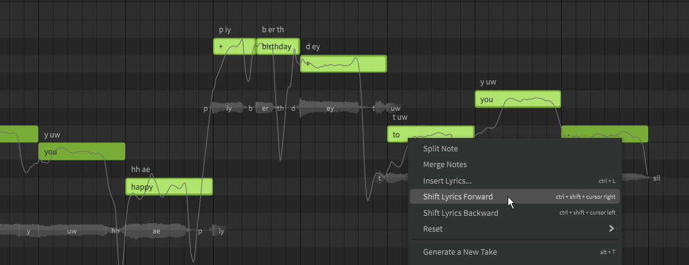

# 批量输入歌词

通过选择多个音符并右键选择“填入歌词...”或“修改”顶部菜单下的选项，或按++ctrl+l++.

对于中文和日文歌词的单词没有空格分隔，选择“按字符隔开”将为每个音符分配一个字符。

如果选择了“重复填充”选项，并且选择的音符多于输入的单词，则歌词将重复填充。

当一次输入多个音符的歌词时，您可能会记错音符的数量，最终得到的歌词与预期目的地略有偏移。这可以通过选择偏移音符并从右键单击菜单中选择“向前转移歌词”(++ctrl+Shift+right++)或“向后转移歌词”(++ctrl+shift+left++)。

## 视频演示

<iframe width="560" height="315" src="https://www.youtube-nocookie.com/embed/Gj7UipbHBdw?start=100" title="YouTube video player" frameborder="0" allowfullscreen></iframe>

---

[报告问题](https://github.com/claire-west/svstudio-manual-zh/issues/new?template=report-a-problem.md&title=[Page: Batch Lyric Input])