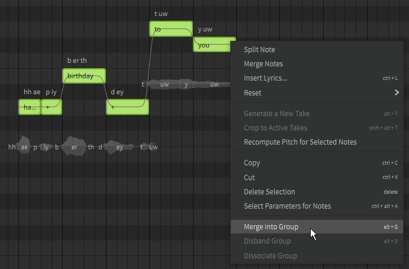
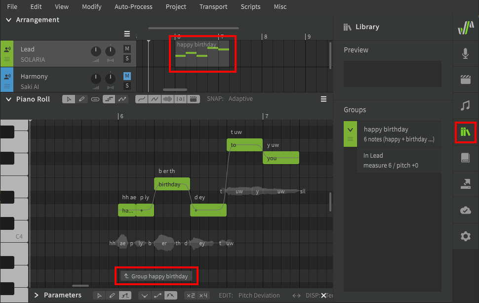
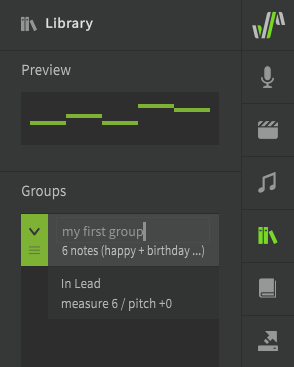
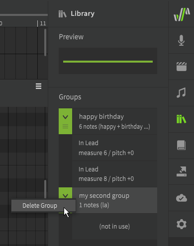
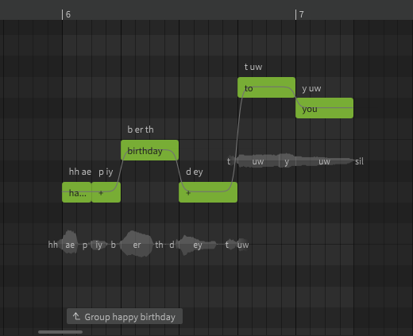
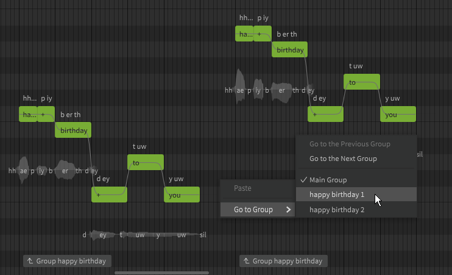
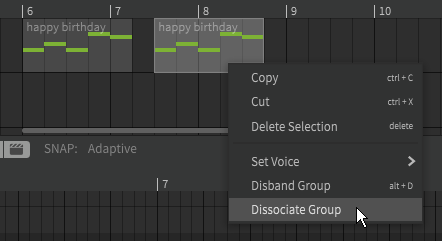
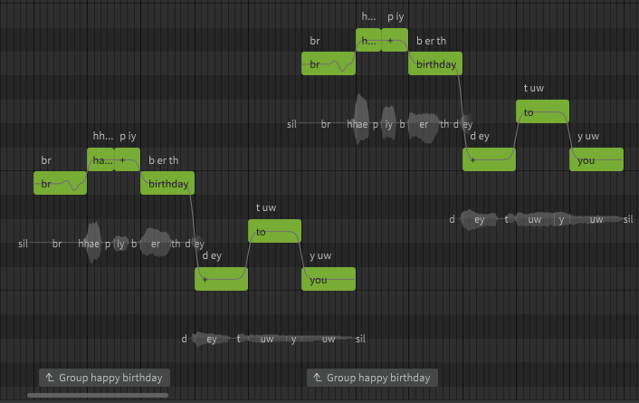
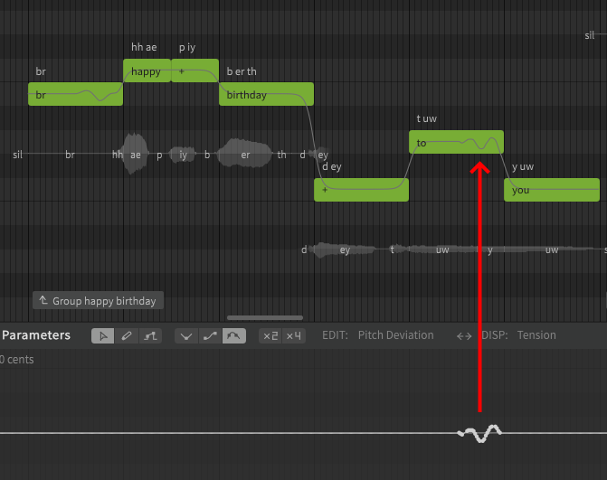

# 音符组

当您的歌曲包含多个相同的乐句时，音符组可以帮助您避免多次出现重复的音符。

## 创建音符组

选择音符，然后从右键菜单中选择“创建音符组”或在“修改”顶部菜单中选择（默认 ++alt+g++）。

创建音符组后，它将在“编曲”面板中显示，在“音符组库”面板中列出，并在钢琴卷帘的底部有一个开始标记。

### 管理音符组

可以在“音符组库”面板中通过双击音符组的名称来重命名，也可以通过拖动左侧绿色控制点来重新排序。

可以将音符组拖动到编曲栏中的任何位置。

与单个音符不同，可以在编曲栏中移动、复制和粘贴音符组。

要从编曲栏中删除音符组，请选择该音符组并按++delete++，或从右键菜单中将其删除。

即使某个音符组不在编曲栏中，它仍将保留在音符组库中。要完全删除音符组，请右键单击它并选择“删除音符组”。

解散音符组（++alt+d++）将导致音符取消分组，但不会从音符组库中删除该组。未分组的音符可以自由修改，而不会影响音符组库中仍然存在的音符组，即使该音符组不再存在于任何轨道中也是如此。如果该音符组稍后被拖回编曲栏中，它将处于解散音符组前的状态。

### 修改音符组

要修改音符组的内容，请双击其中一个音符或单击钢琴卷帘底部的开始标记。

音符组外的区域将变暗，以指示您正在编辑音符组的内容，而不是它所属的轨道。

一个音符组可以具有与其父轨道不同的歌声设置（在“歌声”面板中）。这包括基本参数值、声线参数，甚至不同的歌手。如果未设置这些值，它们将从父轨道继承。

您还可以通过右键单击钢琴卷帘中的空白位置来在音符组之间导航。

## 同一音符组的多个实例

同一音符组可以存在于编曲栏中的多个位置，编曲栏中每个存在的音符组都被称为该音符组的“实例”，所有实例以及它们开始的位置都在“音符组库”面板中可见。

音符组实例保持链接状态，因此对一个实例的更改将影响所有其他实例。这包括对音符和参数曲线的更改。

要删除此链接行为，请右键单击其中一个音符组，然后选择“分离为独立的音符组”。

实例分离后，它将是一个新的音符组的实例，并且可以在不影响原始音符组其他实例的情况下进行修改。

如果选择“解散音符组”而不是“分离为独立的音符组”，则所选音符组实例将恢复为未分组的音符，而同一音符组的其他实例将不受影响。

组实例被视为单独的部分，因此不会在彼此之间平滑过渡，即使直接与另一个音符组或父轨道的音符相邻也是如此。

### 音高偏移

如果您的歌曲有调性更改，但该位置之前和之后的多个乐句在其他方面相同，则可以将音高偏移添加到音符组的各个实例。

在不选择音符组以编辑其内容的情况下，单击并上下拖动音符组。该实例将保持链接到它所属的音符组，但将比其他实例升高或降低一定的音调。

## 音符组重叠

音符组实例不与轨道中存在的其他音符组的内容或父轨道的内容交互。

与重叠音符不同，重叠的音符组可以同时产生输出，因为它们被视为单独的乐句，并且它们的合成输出是单独计算的。

### 继承的参数

上述规则的例外是音符组实例将从父轨道继承所有参数曲线。

这些继承的参数将仅应用于时间轴上同一位置的音符组实例，对轨道或项目中其他位置的同一音符组的实例没有影响。

<figure markdown>
  
  <figcaption>音符组外的音高偏差会影响一个实例的音符。</figcaption>
</figure>

## 视频演示

<iframe width="560" height="315" src="https://www.youtube-nocookie.com/embed/kIn3CRfI4xs" title="YouTube video player" frameborder="0" allowfullscreen></iframe>

---

[报告问题](https://github.com/claire-west/svstudio-manual-zh/issues/new?template=report-a-problem.md&title=[Page: Groups])