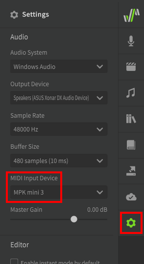
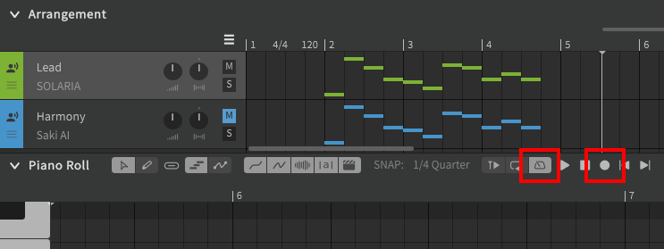
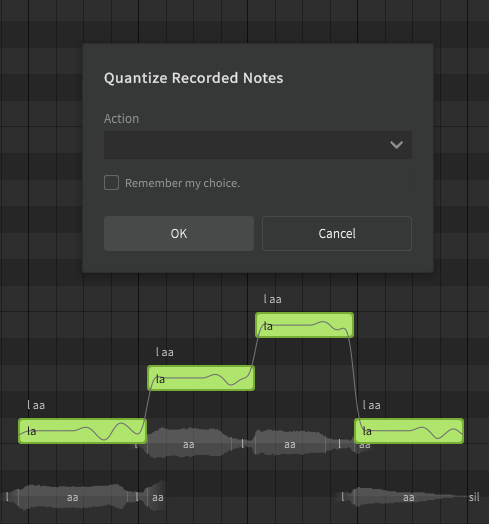
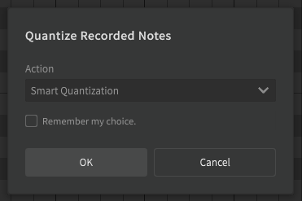
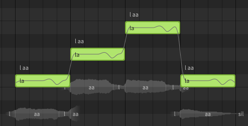
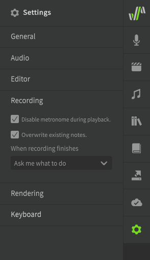

# MIDI控制器支持

!!! note "Pro版功能"

    此功能需要Synthesizer V Studio Pro.

您可以使用 MIDI 控制器将旋律实时录制到钢琴卷帘中。

## 设置
在“设置”面板的“音频”部分中选择您的 MIDI 控制器。

## MIDI录制
要开始录制，请单击位于钢琴卷帘或编曲面板顶部的播放控件中的录制按钮（以焦点位置为准），或使用快捷键（默认++num-asterisk++）.

您可能还希望启用“播放”按钮左侧的节拍器选项。

要停止录制，您可以再次按录制按钮、停止按钮或按 ++space++。

录制旋律后，将弹出对话框进一步操作。

“吸附到网格”将根据当前对齐设置量化音符长度。

“智能量化”将估计适合您的录制的网格对齐设置，而不是使用当前的对齐设置。

按“确定”后，音符将设置为适当的长度。

要将录制音符的原时长保留，请单击“取消”以关闭对话框。

吸附到网格和智能量化可以随时通过“修改”顶部菜单执行。

## 录制选项
“设置”面板具有一些用于 MIDI 录制的附加设置，例如是否在正常播放期间播放节拍器声音，以及在录制时是否覆盖既有音符。

## MMC支持
如果您的 MIDI 控制器具有播放控件，则这些控件可用于导航钢琴卷帘并在Synthesizer V Studio 中触发播放。

## 视频演示

<iframe width="560" height="315" src="https://www.youtube-nocookie.com/embed/KxwLaLn4zbY" title="YouTube video player" frameborder="0" allowfullscreen></iframe>

---

[报告问题](https://github.com/claire-west/svstudio-manual-zh/issues/new?template=report-a-problem.md&title=[Page: MIDI Controller])