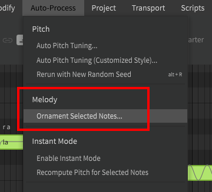

# 自动修饰音符

!!! note "Pro版功能"

    此功能需要Synthesizer V Studio Pro.

“修饰所选音符”是“自动处理”顶部菜单下的一项功能。

## 执行修饰
音符修饰将拆分一些选定的音符以引入音高偏差，并且可以将其视为[自动音高调校](../ai-functions/auto-pitch-tuning.md)的简化版本。

<figure markdown>
  
  <figcaption>音符修饰前后</figcaption>
</figure>

---

[报告问题](https://github.com/claire-west/svstudio-manual-zh/issues/new?template=report-a-problem.md&title=[Page: Note Ornamentation])