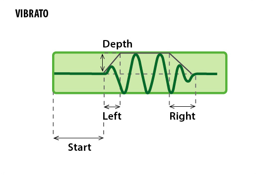

# 手动音高模式

有经验的用户通常希望对人声进行手动控制，而不使用AI自动生成。

手动音高模式下的音符右上角有一个三角形标志，默认情况下有一个扁平的音高线。

音符的颜色将取决于在切换到手动音高模式之前选择的“歌唱”或“说唱”模式，或如果在手动模式下创建音符，则默认为绿色。这可用于直观地描绘项目中的歌唱和说唱部分，但对渲染的输出没有影响。

<figure markdown>
  
  <figcaption>启用了手动音高模式的音符</figcaption>
</figure>

## 手动音高设置

选择“手动音高模式”后，“音符属性”面板中将提供更多的用于调节过渡和颤音的选项。

音高转变和颤音设置用于粗略地快速设置音高曲线，细节可通过[参数面板](../parameters/parameters-panel.md)进行微调。

音高转变控制音符边界附近的音高曲线部分，颤音适用于音符的中间。

音高转变和颤音滑块的默认值由它们在“歌声”面板中的默认设置确定。某些设置只能为单个音符设置，并且不能在“歌声”面板中设置相应的默认值。

## 音高转变

这组滑块与音符之间的过渡有关。

<figure markdown>
  
  <figcaption>“歌声”（左）和“音符属性”（右）面板中的过渡滑块</figcaption>
</figure>

**偏移**
: 向左或向右移动音符音高曲线的起点，这也会影响上一个音符的末尾。偏移不会影响音符的颤音或过渡到下一个音符。

**时长 - 左**
: 音符起始点与音高曲线达到音符目标音高的点之间的时长，音高曲线的这一部分通常被称为“音头”。

**时长 - 右**
: 音符结束前音高偏离“深度”设置的时长，音高曲线的这一部分通常被称为“音尾”。

**深度 - 左**
: 根据“时长 - 左”设置调整音符开头和过渡结束附近的音高。负值将接近向上一个音符音高，正值将远离上一个音符音高。

**深度 - 右**
: 根据“时长 - 右”设置调整音符末尾的音高。负值将接近下一个音符音高，正值将远离下一个音符音高。

### 可视化音高转变设置

此图说明了每个滑块如何影响音符 A（左下）和音符 B（右上）间的音高曲线。

## 颤音

颤音滑块会产生类似正弦波的的音高曲线，可用于快速将颤音添加到音符中。

这种基于表达式的曲线独立于其他方式引入的颤音曲线，包括由用户手动绘制的颤音形状曲线。

!!! note "注意"

    创建颤音的其他方法（如[自动音高调校](../ai-functions/auto-pitch-tuning.md)或[歌唱音高模式](../ai-functions/pitch-mode-sing.md)）将在不使用本组设置的情况下创建更复杂的颤音曲线，并且这些方式不会受到此设置或[颤音包络参数](../parameters/editing-parameters.md#vibrato-envelope)的影响。

    虽然颤音包络参数可以在启用歌唱模式时影响其生成的颤音，但在启用手动模式后，它不会继续这样做。在手动模式下，颤音包络参数仅调制正弦曲线的振幅，如下面所示的深度滑块所指示的那样。

<figure markdown>
  
  <figcaption>“歌声”（左）和“音符属性”（右）面板中的颤音滑块</figcaption>
</figure>

**开始**
: 颤音开始之前的延迟，从音符起点开始测量。

**左**
: 颤音达到最大振幅之前缓入行为的持续时间。

**右**
: 缓出行为的持续时间，其中颤音曲线在音符尾部结束。

**深度**
: 类似正弦曲线的振幅（以半音为单位）。
: 深度为0将生成一条平滑的线（无颤音）。

!!! warning "警告"

    执行[自动音高调校](../ai-functions/auto-pitch-tuning.md)会将所选音符的颤音深度设置为零，但已在“音符属性”面板中手动设置颤音深度的音符除外。发生这种情况后，颤音深度将不再继承自“歌声”面板中的默认设置。

    如果音符以前设置为[“歌唱”](../ai-functions/pitch-mode-sing.md)或[“说唱”](../ai-functions/pitch-mode-rap.md)音高模式，则颤音深度滑块也将设置为零。

    要继续使用颤音滑块，请在相关音符的“音符属性”面板中增加颤音深度。

    

**频率**
: 颤音振荡的速度（每秒周期数）。

**相位**
: 正弦波状颤音开始时相对于完整周期的相位。

**抖动**
: 在音高曲线上增加了多少自然音高波动（仅限非 AI 歌手）。

### 可视化颤音设置

此图说明了每个颤音滑块如何影响音符的音高曲线。颤音前后的音高曲线基于上述音高转变设置。

## 在手动音高模式下创建音符

要将新音符默认为“手动音高模式”，请更改“设置”面板中的“音符的默认音高模式”选项。

## 手动音高模式与歌唱或说唱模式相结合

为先前设置为“歌唱”或“说唱”音高模式的音符启用手动音高模式可用于“冻结”音符的音高，以防止在更改音符上下文时重新计算音高。

<figure markdown>
  
  <figcaption>手动音高模式下的音符，以前处于说唱模式。生成的音高曲线已被“锁定”，以防止发生意外变化。</figcaption>
</figure>

有关切换音高模式的更多信息，请访问[音高模式：歌唱](../ai-functions/pitch-mode-sing.md#disabling-sing-mode)和[音高模式：说唱](../ai-functions/pitch-mode-rap.md#disabling-rap-mode)页面

---

[报告问题](https://github.com/claire-west/svstudio-manual-zh/issues/new?template=report-a-problem.md&title=[Page: Manual Pitch Mode])