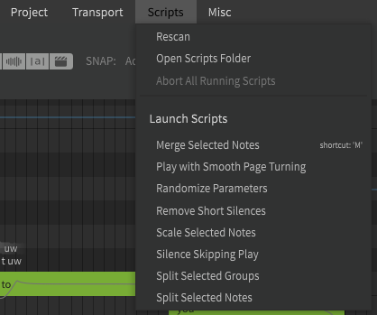
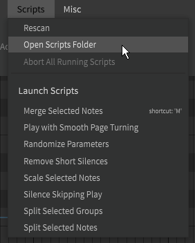
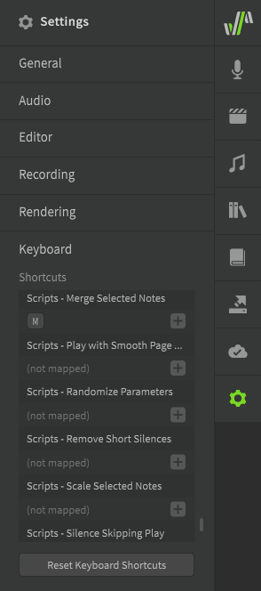

# 脚本

!!! note "Pro版功能"

    以下功能需要Synthesizer V Studio Pro。

Synthesizer V Studio Pro 支持使用 JavaScript 和 LUA 编写脚本。用户可以使用自己的脚本来增强编辑器的功能。

## 使用脚本

一些脚本包含在Synthesizer V Studio Pro中，这些脚本可以通过“脚本”顶部菜单访问。

从下拉列表中选择一个脚本以执行它。

### 添加新脚本

选择“打开脚本文件夹”将打开操作系统的文件浏览器，并显示脚本文件夹。

将任何新脚本拖到此脚本文件夹中，然后选择“重新扫描”或重新启动Synthesizer V Studio。新脚本现在将显示在下拉列表中。

根据您的操作系统，此文件夹将位于以下位置：

|操作系统|文件夹位置|
|---|---|
|Windows|`Documents\Dreamtonics\Synthesizer V Studio\scripts`|
|MacOS|`/Library/Application Support/Dreamtonics/scripts`|
|Linux|`<your installation directory>/scripts` 例如 `/opt/Synthesizer V Studio Pro/scripts`|

### 给脚本分配快捷键

可以从“设置”面板底部的“快捷键”部分为脚本分配快捷键。

## 创建脚本

有关如何创建自己的脚本，请访问[官方脚本手册](https://resource.dreamtonics.com/scripting/)。

### 未记录的函数和属性

官方文档中未提及一些脚本功能。

#### 音区偏移和声线

!!! info "信息"

    使用音区偏移的脚本`minEditorVersion`应至少声明为**65792**。

    使用声线的脚本需要**67072**或更高版本。

音区偏移和声线的自动化对象定义如下：

|`displayName`|`typeName`|`range`|`defaultValue`|
|---|---|---|---|
|"Tone Shift"|"toneShift"|-800, 800|0|
|"`<Vocal Mode Name>`"|"vocalMode_`<Vocal Mode Name>`"|-150, 150|0|

例如，当为"Soft"声线获取`NoteGroup`的自动化对象时，函数将是`noteGroup.getParameter("vocalMode_Soft")`。

!!! warning "警告"

    为声线使用`getParameter()`将自动为轨道初始化它，即使提供的声线名称不存在也是如此。

#### `Note`属性和函数

在 1.9.0b2 版本中，向`Note` 类中添加了一些额外的绑定，以允许脚本访问音符级语言选择、音高模式和说唱功能。

!!! info "信息"

    使用这些附加绑定的脚本`minEditorVersion`应至少声明为**67840**。

`note.getRapAccent()`返回一个介于 1-5 之间的整数（仅适用于普通话说唱）。

`note.setRapAccent(integer)`（仅适用于普通话说唱）。

`note.getMusicalType()`返回基于所选音高模式的字符串（“唱”或“说唱”）。

`note.setMusicalType(string)`

`note.getPitchAutoMode()`返回一个整数，表示音高模式是设置为手动 （0） 还是自动 （1）。

`note.setPitchAutoMode(integer)`

`note.getLanguageOverride()`返回一个字符串，表示笔记的选定语言("japanese", "english", "mandarin", "cantonese").

`note.setLanguageOverride(string)`

此外，属性对象上还存在以下新属性：

`rIntonation`: `number` 说唱音高 (-0.5 到 0.5)

`rTone`: `number` 说唱音区 (半音，从 -5 到 1)

---

[报告问题](https://github.com/claire-west/svstudio-manual-zh/issues/new?template=report-a-problem.md&title=[Page: Scripting])