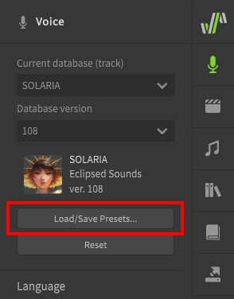

# 侧面板

此页面涵盖有关侧面板且其他页面不包含的的信息，或链接到相关功能的对应页面。

## 歌声面板

### 选择歌手

**当前声库**
: 请参阅[选择歌手](../quickstart/singer-selection.md)

**保存/载入预设**
: 允许将当前的声库设置保存为预设。这包括声线、默认参数值和默认音高转变/颤音设置。
: 语音预设特定于声库，因此要将预设用于其他歌手，您必须首先选择保存预设的原始歌手，加载预设，然后切换到所需的其他歌手。
: 

### 语言

**使用以下的语言歌唱**
: 请参阅[编辑音素 → 跨语言合成](../note-properties/editing-phonemes.md#cross-lingual-synthesis)

**使用松弛的辅音发音**
: 使用更适合美式英语的音素转换规则。

### 声线
请参阅[声线参数](../ai-functions/vocal-modes.md)

### 参数
请参阅[编辑参数 → 基础值](../parameters/editing-parameters.md#base-values)

### 音准
音高偏移
: 允许当前轨道/音符组在任一方向上移动最多 50 音分。

音调偏移
: 允许当前音轨/音符组在任一方向上移动最多一个八度。

### 合成引擎
渲染模式
: “速度优先”将以牺牲质量为代价更快地渲染，但会导致更多的噪音和更低的质量。“精简版”版本的歌声数据库仅可使用此设置。
: “质量优先”将以最高质量输出音频，但在某些设备上可能运行速度较慢。

### 默认 - 歌唱模式
请参阅[音高模式：歌唱](../ai-functions/pitch-mode-sing.md)

### 默认 - 手动模式
请参阅[手动音高模式](../advanced/pitch-mode-manual.md)

## AI重录面板
请参阅[AI重录](../ai-functions/ai-retakes.md)

## 音符属性面板

### 切换当前选择
选择当前曲目/音符组中的上一个/下一个音符。

### 语言

**使用以下的语言歌唱**
: 请参阅[编辑音素 → 跨语言合成](../note-properties/editing-phonemes.md#cross-lingual-synthesis)

### 音高模式

请参阅[音高模式：歌唱](../ai-functions/pitch-mode-sing.md)，[音高模式：说唱](../ai-functions/pitch-mode-rap.md)和[手动音高模式](../advanced/pitch-mode-manual.md)

将根据所选的音高模式显示其他选项。

### 时间和音素
**音符偏移**
: 请参阅[音符和音素时长](../note-properties/note-and-phoneme-timing.md)

**音素**
: 请参阅[编辑音素](../note-properties/editing-phonemes.md)

**时长**
: 请参阅[音符和音素时长 → 音素时长](../note-properties/note-and-phoneme-timing.md#phoneme-timing)和[备用音素和音素力度](../note-properties/alternate-phonemes.md)。

**力度**
: 请参阅[备用音素和音素力度 → 音素力度](../note-properties/alternate-phonemes.md#phoneme-strength)

### 表现力分组
请参阅[表现力分组](../note-properties/expression-groups.md)

## 音符组库面板
请参阅[音符组](groups.md)

## 词典面板
请参阅[用户词典](user-dictionaries.md)

## 渲染面板
请参阅[导出音乐](../quickstart/saving-the-audio.md)

## 授权和更新面板
请参阅[安装和激活](../setup.md)

## 设置面板

### 通用
**界面语言**
: Synthesizer V Studio用户界面中显示的语言，更多语言可以从Dreamtonics官方[GitHub仓库](https://github.com/Dreamtonics/svstudio-translations)中下载。

**界面缩放比例**
: 增大或减小应用程序中所有可视元素的大小。

**使用OpenGL渲染图型界面**
: 使用 OpenGL 在渲染图形界面时获得更好的性能。可能会导致某些平台上出现兼容性问题。

**显示状态栏**
: 请参阅[工作区 → 状态栏](../workspace/layout.md#the-status-bar)

**自动检测更新**
: 将在启动时检查Synthesizer V Studio和已安装的歌声数据库的更新。

**配置诊断数据采集**
: 向Dreamtonics匿名发送使用信息以改进软件。

### 音频
单独启动时，包含与设备的音频硬件相关的选项。

作为插件启动时，显示如何将输出通道发送到 DAW（请参阅[DAW集成 → 输出通道](../daw-integration/plugin.md#output-channels)）。

**MIDI输入设备**
: 请参阅[MIDI控制器支持](midi-controller.md)

**总增益**
: 调整Synthesizer V Studio 所有音频的音量(-12dB到+6dB).

### 编辑器
**在回放过程中跟随走带位置**
: 在播放过程中，当播放头移出视图时是否移动视口。

**伸缩音符时避免重叠**
: 如果调整音符大小会导致其与其相邻音符重叠，则会调整相邻音符的大小以防止重叠。

**动态显示渲染进度**
: 高亮显示每个音符下方的波形以指示渲染进度。

**显示角色背景图（如存在）**
: 在钢琴卷帘中显示歌声数据库的角色图（如果存在），使用的图像位于歌声数据库安装目录中的`background.png`文件。

**图片透明度**
: 如果启用了“显示角色背景图”，则为当前歌声数据库设置角色图的不透明度。

**横向移动**、**横向缩放**和**纵向移动**
: 请参阅[工作区 → 工作区导航](../workspace/layout.md#workspace-navigation)

**启动2D鼠标滚轮**
: 启用具有侧向单击功能的鼠标滚轮的兼容。

**默认粘贴行为**
: 选择应根据播放头位置还是保持屏幕上的位置作为粘贴音符或参数点的位置。

**音符的默认歌词**
: 在钢琴卷帘中创建的新音符时的默认歌词。

**音符的默认音高模式**
: 在钢琴卷帘中创建新音符的默认[音高模式](../note-properties/pitch-transition-and-vibrato.md) 。

**参数选项**
: 请参阅[编辑参数 → 附加参数](../parameters/editing-parameters.md#additional-functions)

### 录制
请参阅[MIDI控制器支持 → 录制选项](midi-controller.md#recording-options)

### 渲染
**后台线程数量**
: 实时渲染期间使用的最大并发线程数。

!!! note "Pro版功能 - Synthezier V Studio Basic限制最多了2个线程"

**回放缓冲区长度**和**引擎采样率**
: 实时渲染引擎的音频设置。实际输出将使用[音频](#audio)部分中的设置（如果未作为插件运行）或 DAW 的音频设置（如果作为插件运行）。
: 最终渲染输出将使用“渲染”面板中的设置（请参阅[导出音乐](../quickstart/saving-the-audio.md)）。

**功耗管理**
: 限制性能以节省电池或减少系统负载，“最大性能”将导致最高的系统负载，但执行速度更快。“省电模式”将运行得更慢，但消耗更少的电量，并且对系统硬件的要求较低。

### 键盘
允许将快捷键分配给可通过顶部菜单或脚本访问的任何选项。

---

[报告问题](https://github.com/claire-west/svstudio-manual-zh/issues/new?template=report-a-problem.md&title=[Page: Side Panels in Detail])