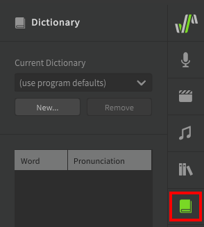
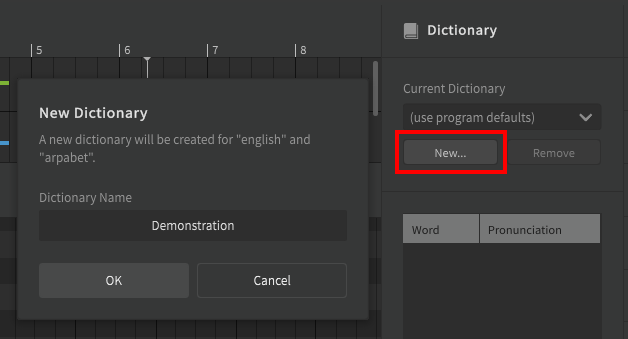
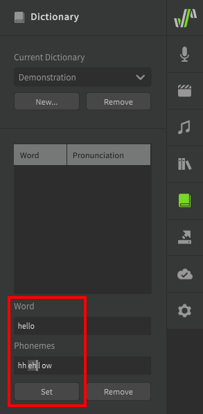
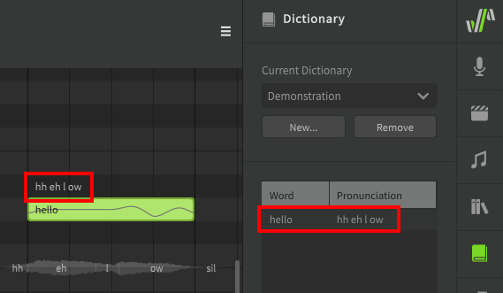
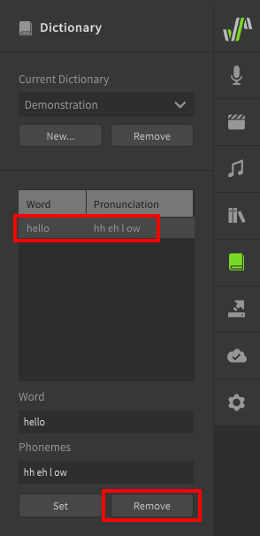
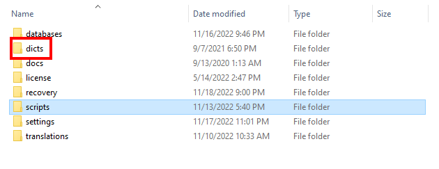

# 用户词典

字典可用于自定义单词到音素的转换。

当音符的歌词转换为音素时，它将首先检查当前所选词典中的条目。如果没有自定义条目或未选择字典，则将使用默认音素转换。如果同一个单词在项目中多次出现，并且您希望该单词的所有实例都使用[修改后的音素序列](../note-properties/editing-phonemes.md#changing-a-notes-phonemes)，则这可能会有所帮助。

可以从侧面板访问“词典”面板。

## 创建词典

要创建词典，请打开词典面板并单击“新建”。

创建词典后，当前所选轨道将使用新词典。其它轨道不受其影响。

每个轨道/音符组都可以使用不同的词典，以适应不同声库或歌手的不同发音或声线。

## 添加字典条目

通过输入要使用的单词和所需的音素序列来添加字典条目。

一旦某个单词出现在正在使用的词典中，该单词在此轨道/音符组组中的所有实例都将使用新的音素序列，除非它们的音素是手动设置的。

!!! note "注意"

    字典只会覆盖单词到音素的转换。例如，上面的条目将“hello”映射到`hh eh l ow`而不使用默认的`hh ax l ow`，因为这些都是基于说话者不同口音的常见发音。

    尝试在“单词”文本框中输入原始音素序列(`hh ax l ow`)不会将输入的音素替换为输入了“hello”作为歌词的音符。

请注意，音符上方的音素文本为白色，表示它基于歌词到音素的自动转换，而不是手动输入。字典条目不会覆盖已手动设置音素的音符（绿色文本）。

### 删除字典条目

要删除字典条目，请从列表中选择它，然后选择“删除”。

## 词典和跨语言合成

!!! note "Pro版功能"

    跨语言合成需要Synthesizer V Studio Pro。

字典列表将始终基于当前歌声数据库的母语加载，即使该语言与当前选择的语言不匹配。

例如，要将英语词典与母语日语歌声数据库一起使用，您首先需要将词典文件移动或复制到`dicts/japanese-romaji`文件夹中，即使跨语言合成使用的音素标准是arpabet.

可以在每个操作系统的以下位置找到`dicts`文件夹：

|操作系统|文件夹位置|
|---|---|
|Windows|`Documents\Dreamtonics\Synthesizer V Studio\dicts`|
|MacOS|`/Library/Application Support/Dreamtonics/dicts`|
|Linux|`<your installation directory>/dicts` 例如： `/opt/Synthesizer V Studio Pro/dicts`|

字典文件夹与脚本文件夹位于同一位置，因此可以通过从“脚本”顶部菜单中选择“打开脚本文件夹”来找到该文件夹。

---

[报告问题](https://github.com/claire-west/svstudio-manual-zh/issues/new?template=report-a-problem.md&title=[Page: User Dictionaries])