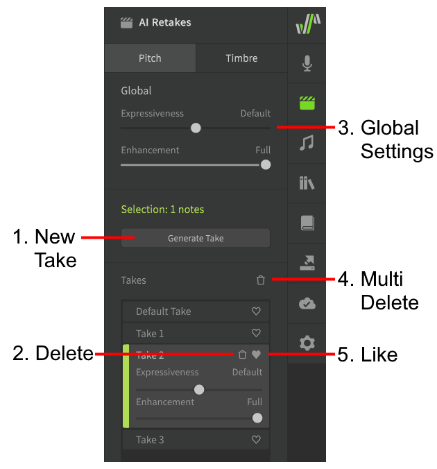
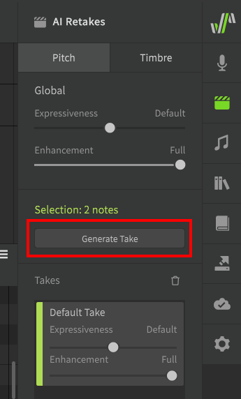
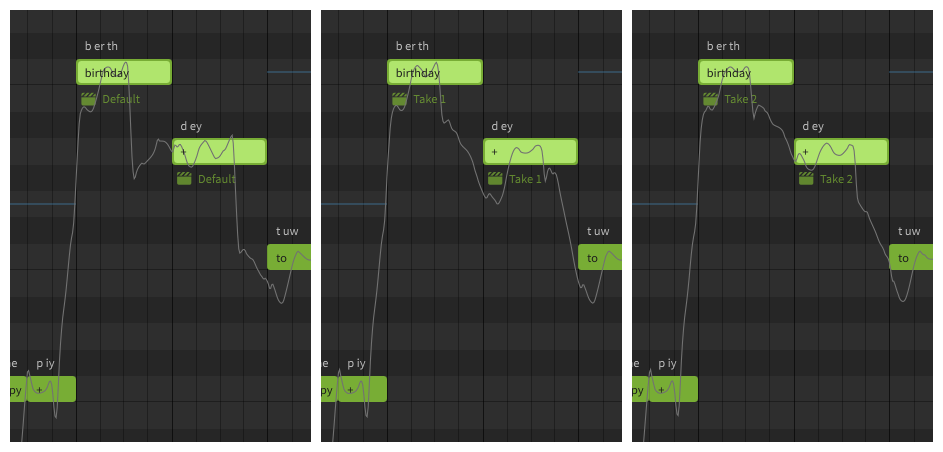
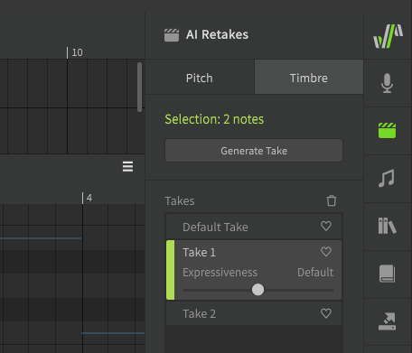
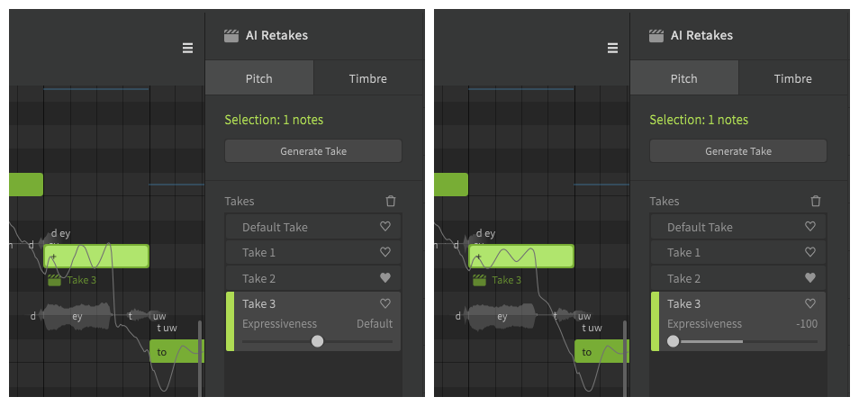

# AI重录

!!! note "Pro版功能"

    以下功能需要Synthesizer V Studio Pro.

可以通过[侧面板](../workspace/side-panels.md)访问AI重录，并可以浏览指定音符的多个不同重录结果。

## 管理重录

### 1. 新建重录
为所选音符生成新的重录（默认++alt+t++）。

### 2. 删除
删除重录

### 3. 删除多个
用于删除未使用的重录或仅删除未标记的重录（默认++shift+alt+t++）。

### 4. 喜欢
标记首选重录。

## 音高重录

要生成新的重录，请选择一个或多个音符，然后在AI重录面板中单击“生成新的重录”。

!!! info "音高重录只能为使用“歌唱”或“说唱”音高模式的音符生成。"

音高重录将产生不同的音高曲线，并可用于微调音符过渡和颤音。

通过从列表中选择不同的重录，您可以看到音高曲线根据选择而变化。

!!! note "注意"

    “歌唱”和“说唱”音高模式引入的音高偏差是特定于上下文的，因此生成的重录也是如此。建议您确保所有音符都在适当的时间放置，并且在生成重录之前已插入所有相邻的呼吸音。

<figure markdown>
  
  <figcaption>比较三个不同的重录</figcaption>
</figure>

## 音色重录

音色重录可以采用与音高重录相同的方式生成，但需要在手动音高模式下使用。

这些重录将修改与音高无关的声音品质，例如音色、力度、发音等。这有助于微调声门声音，例如气泡音，在音符之间创建更平滑的过渡，或调整呼吸音的强度。

## 表现力

表现力滑块可用于调整音高或音色偏差的幅度。

如果未选择任何音符，则此滑块将影响轨道或音符组中尚未单独设置表现力值的音符的默认表现力。

## 随机性和概率

生成新的 AI 重录相当于掷多次骰子，当生成新的重录时，概率分布和可能结果集不会改变，但您可以根据相同的输入或情况浏览并从许多可能性中进行选择。

在编程术语中，生成新的重录会执行多次相同的过程，每次执行都有不同的[随机种子](https://en.wikipedia.org/wiki/Random_seed)。

### 可能影响结果的因素

AI 重录的结果可能因多种因素而异：

* 选择的歌声数据库
* 音符的上下文（音高、持续时间、音素和相邻音符的属性）
* [声线](vocal-modes.md)设置（仅影响音色重录）

如果这些因素中的任何一个发生变化，即使已经生成，AI重录的结果也可能有所不同。

### 机器学习模型中的偏差

每个歌声数据库（和声线）都包含基于声库供应商歌声的原始录音的某些偏差。

对于倾向于使用人声的歌声数据库，您可能需要生成更多的音色重录才能找到没有这种行为的数据库。同样，一些歌声数据库对该行为几乎没有偏向，因此可能不会产生该结果。

同样的概念也适用于歌声的其他方面，例如过渡、颤音、力度等。

## 视频演示

<iframe width="560" height="315" src="https://www.youtube-nocookie.com/embed/VyvXI3jEyRo" title="YouTube video player" frameborder="0" allowfullscreen></iframe>

---

[报告问题](https://github.com/claire-west/svstudio-manual-zh/issues/new?template=report-a-problem.md&title=[Page: AI Retakes])