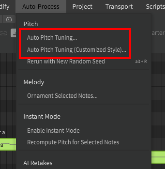
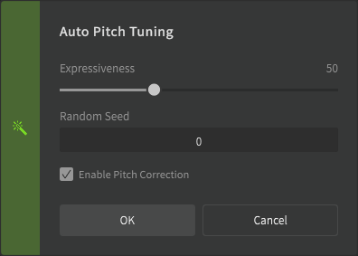
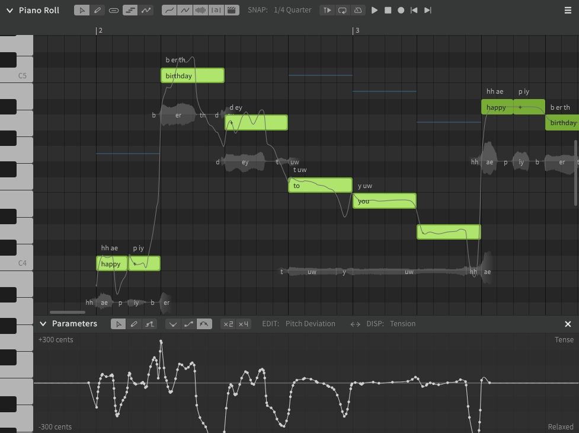
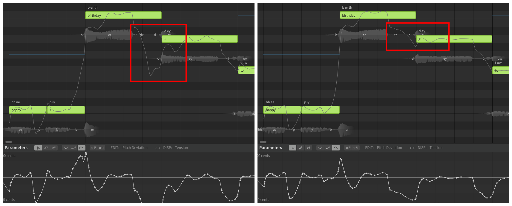
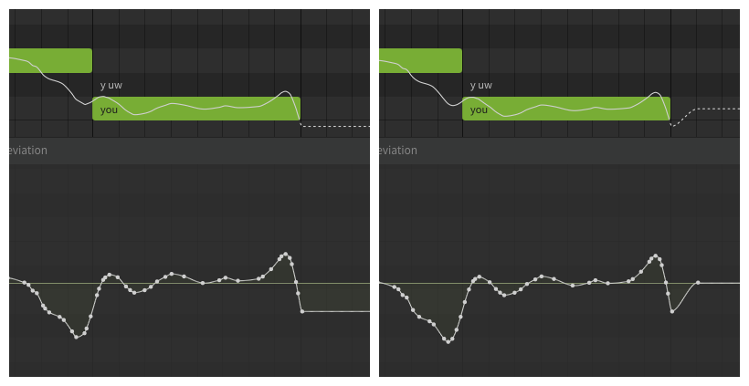
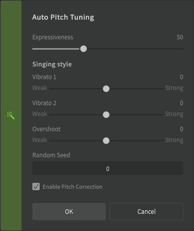
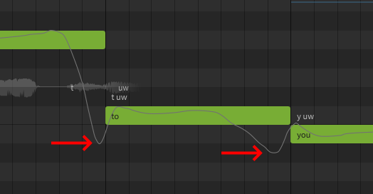

# 自动音高调校

自动音高调校是“自动处理”顶部菜单下的一项功能。使用专业版时，“（自定义风格）”选项提供了额外的颤音和衔接力度滑块。

此功能可添加 AI 生成的音高偏差，类似于[歌唱音高模式](pitch-mode-sing.md)，但更加可控和可自定义，并且在音符的上下文发生变化时不会自动改变。

如果未选择任何音符，或者所选音符未处于手动模式，则这些选项将不可用。

## 执行自动音高调校

执行自动音高调校会将音高偏差添加到当前所选音符的参数面板中。这些音高偏差会因当前选择的歌声数据库而有所不同，并且会有声库提供商演唱风格的机器学习分析。

!!! “自动音高调校”只能对设置为[手动音高模式](../advanced/pitch-mode-manual.md)的音符执行。

有关使用快捷键一次选择多个音符的方法，请参阅[编辑音符](../quickstart/editing-notes.md#selecting-notes)。

自动音高调校引入的音高偏差是特定于上下文的。

音符的“上下文”基于其音高、持续时间和音素，以及前后音符的同种属性。如果这些因素中的任何一个发生变化，自动音高调校的结果就会有所不同。

### 表现力
表现力滑块确定音高偏差的变化程度以及它们与音符的偏差程度。

<figure markdown>
  
  <figcaption>表现力设置为100（左）和25（右）</figcaption>
</figure>

### 音高补正

启用音高补正将尝试防止 AI 生成的即兴创作相对于钢琴卷帘中的其他音符过于平坦或尖锐。

此功能计算音符持续时间内的平均音高，并移动音符的整个曲线，使其更接近音符在钢琴卷帘中的目标音高。

在此示例中，当执行自动音高调校而不进行音高补正时，音高曲线有些尖锐。在启用该设置的情况下重新生成时，音符的音高曲线向下移动以更接近音符的中心。曲线的形状不会改变。

<figure markdown>
  
  <figcaption>音高补正关闭（左）和打开（右）</figcaption>
</figure>

要注意，这些更正是针对每个音符计算的，而不是以连续的方式计算的。注意音高曲线如何对应钢琴卷帘中的音符向上或向下移动。

该视频显示了未启用（之前）和启用（之后）音高校正的比较。

### 以新的随机数重新生成

“以新的随机数重新生成”选项（++alt+r++）将生成不同的音高曲线，即使音符的上下文未更改也是如此。这可用于生成不同的重录。

## 自定义风格选项

!!! note "Pro版功能 - 自动音高调校（自定义风格）选项仅在Synthesizer V Studio Pro中可用。"

!!! warning "推测性信息"

    关于此选项，Dreamtonics没有明确的说明。以下信息基于用户观察，可能并不完全准确。

执行“自定义风格”版本的自动音高调校时，除了通常的表现力滑块外，对话框中还有其他滑块。

#### 颤音1

“强”设置将导致AI引擎在应用AI生成的音高偏差（颤音和衔接）时更加“挑剔”。“弱”设置将允许音高偏差应用于更多音符，更强烈。

#### 颤音2

影响 AI 生成的颤音的强度。

#### 衔接力度

影响音高转换前后超出音符的音高偏差强度。

---

[报告问题](https://github.com/claire-west/svstudio-manual-zh/issues/new?template=report-a-problem.md&title=[Page: Auto Pitch Tuning])