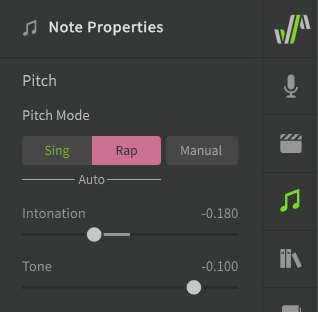
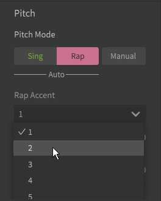
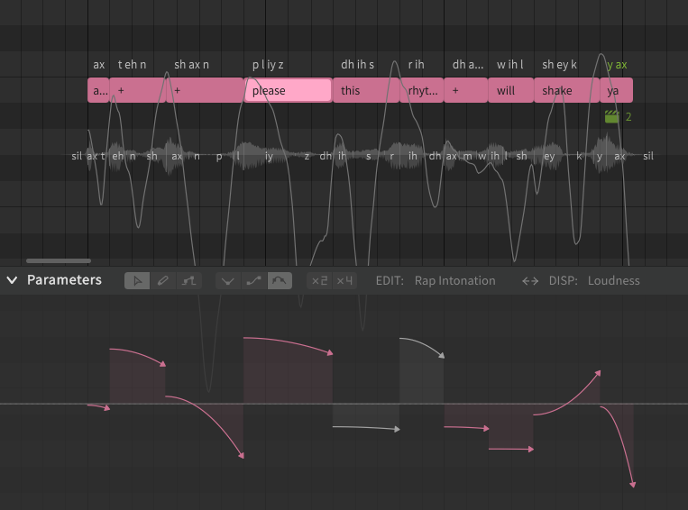

# 音高模式：说唱

“说唱”音高模式会将 AI 生成的音高偏差添加到您的音符中，这些音符经过建模以模仿人类的说唱，并允许使用说唱音高参数。

!!! warning "警告"

    说唱模式仅适用于英语和普通话。日语相关支持目前正在开发中。

## 启用说唱模式

可以从“音符属性”菜单中为音符启用说唱模式。使用说唱模式的音符在钢琴卷帘中为红色。

请注意，“手动”按钮为暗色时，表示手动音高模式已禁用，并且将自动生成音高曲线。

!!! info "提示"

    说唱模式生成的音高偏差是特定于上下文的。

    音符的“上下文”包括其音高、持续时间和音素，以及之前和之后音符的同种属性。如果这些因素中的任何一个产生变化，将会重新计算音符的音高偏差。

    如果您喜欢为音符或发音生成的音高，请考虑为其启用[手动模式](../advanced/pitch-mode-manual.md)，以避免意外触发音高自动重新计算。

启用说唱模式还允许使用[AI重录](ai-retakes.md)功能。

### 说唱音调

“说唱音调”下拉列表可用于生成音符的变体。

此选项仅适用于普通话。

### 音高

使音符的音高在其持续时间内上升或下降。

此滑块的值链接到音符说唱音高参数的向上或向下曲线。

### 音区

将音符的整体音高修改为更高或更低，而不影响其持续时间内语调的变化。该值以半音表示。

此滑块的值链接到音符说唱音高参数的垂直位置。

## 说唱音高参数

说唱音高参数允许在音符或短语中轻松编辑音高和音区。与其他参数不同，说唱语调表示为一系列箭头，而不是连续曲线。

每个箭头表示关联音符持续时间内的音高移动。每个箭头的位置链接到“音符属性”面板中的音区。

要修改箭头的垂直位置（音区），请单击并拖动箭头的线条部分。要更改曲线朝向（音高），请单击并拖动箭头的头部。

## 禁用说唱模式

如果您在启用说唱模式时切换到[手动音高模式](../advanced/pitch-mode-manual.md)：

* 生成的音高偏差将移至参数面板，以便进一步手动编辑
* 颤音深度将默认设置为零，而不是从“歌声”面板中的默认设置继承
* 说唱音高参数将不再可用，但设置不会丢失，您可以通过重新启用说唱模式来恢复说唱音高参数

这意味着音符的音高曲线将与切换到手动音高模式之前相同，如果要使生成的音高偏差持久存在，则可以考虑禁用说唱模式，这样在音符的上下文更改时就不会重新计算它们。

## 从手动音高模式切换到说唱模式

将音符从手动音高模式更改为说唱音高模式将覆盖参数面板中现有的音高偏差。切换回手动音高模式不会恢复被覆盖的音高偏差。

## 视频演示

<iframe width="560" height="315" src="https://www.youtube-nocookie.com/embed/Z6OB3jHiBBk" title="YouTube video player" frameborder="0" allowfullscreen></iframe>

---

[报告问题](https://github.com/claire-west/svstudio-manual-zh/issues/new?template=report-a-problem.md&title=[Page: Rap Pitch Mode])