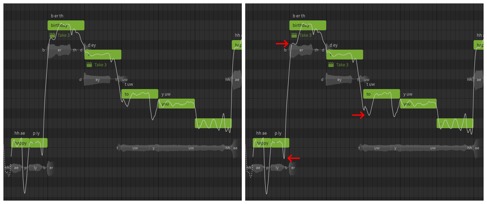
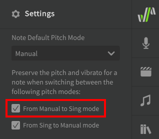

# 音高模式：歌唱

“歌唱”音高模式（以前称为“即时模式”或“自动音高模式”）会将 AI 生成的音高偏差添加到您的音符中，这些音符经过建模以产生逼真的过渡、延音和颤音。

歌唱模式可与传统软件合成器和效果插件中包含的预设库相媲美，它可以帮助新用户快速获得成果，并可以进一步修改，还可以帮助用户了解逼真的声音对应的音高曲线样式。

有经验的用户可能更喜欢使用手动音高模式来完全控制人声，或者为了使用[手动音高模式](../advanced/pitch-mode-manual.md)或修改[自动音高调教](auto-pitch-tuning.md)参数来更好地自定义 AI 生成的音高曲线。

## 启用歌唱模式

可以从“音符属性”菜单中为音符启用歌唱模式。使用歌唱模式的音符在钢琴卷中将为绿色。

请注意，“手动”按钮为暗色时表示手动音高模式已禁用，并且将自动生成音高曲线。

!!! info "提示"

    歌唱模式引入的音高偏差是特定于上下文的。

    音符的“上下文”包含其音高、持续时间和音素，以及之前和之后音符的同种属性。如果这些因素中的任何一个产生变化，将重新计算音符的音高偏差。

    如果您喜欢为音符或发音生成的音高，请考虑为其启用[手动模式](../advanced/pitch-mode-manual.md)，以避免意外触发音高自动重新计算。

启用歌唱模式时还可以使用[AI重录](ai-retakes.md)功能。

### 颤音调制

!!! note "Pro版功能"

    颤音调制设置仅在Synthesizer V Studio Pro中可用。

颤音调制设置会影响生成颤音的深度（振幅），这也可以在音符的持续时间内使用[颤音包络](../parameters/editing-parameters.md#vibrato-envelope)参数调整。

颤音调制参数的默认值可在“歌声”面板中设置。

### 即兴发挥音符的起音和收音

!!! note "Pro版功能"

    即兴发挥音符的起音和收音功能仅在Synthesizer V Studio Pro中可用。

此设置将导致生成的音高转变进一步偏离音符的目标音高，即兴发挥在音高差异较大的音符之间最为明显。

此设置只能在歌声面板中为整个轨道/音符组设置。

<figure markdown>
  
  <figcaption>禁用此设置（左）和启用此设置（右）的区别</figcaption>
</figure>

## 禁用歌唱模式

如果在歌唱模式已启用时启用手动音高模式：

* 生成的音高偏差将移至参数面板，以便进一步手动编辑
* 颤音深度将默认设置为零，并不会从“歌声”面板中的默认设置继承。

这意味着音符的音高曲线将与切换到手动音高模式之前相同。如果要“冻结”生成的音高偏差，可以考虑禁用“歌唱模式”，这样在音符的上下文更改时就不会重新计算它们。

可以通过禁用设置面板中的“从歌唱模式到手动模式”选项来更改此行为。

## 从手动音高模式切换到歌唱模式

将音符从手动音高模式更改为歌唱模式将覆盖参数面板中现有的音高偏差。切换回手动音高模式不会恢复被覆盖的音高偏差。

可以通过在设置面板中启用“从手动到歌唱模式”选项来更改此行为。

## 视频演示

<iframe width="560" height="315" src="https://www.youtube-nocookie.com/embed/Z6OB3jHiBBk" title="YouTube video player" frameborder="0" allowfullscreen></iframe>

---

[报告问题](https://github.com/claire-west/svstudio-manual-zh/issues/new?template=report-a-problem.md&title=[Page: Sing Pitch Mode])