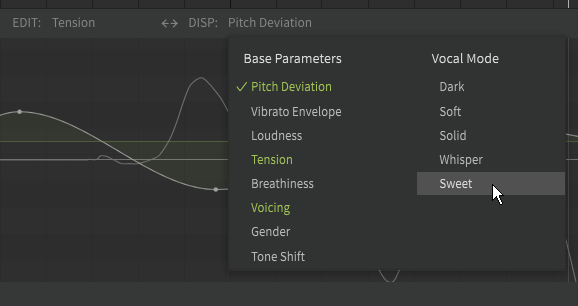

# 声线参数

!!! note "Pro版功能"

    以下功能需要Synthesizer V Studio Pro。

## 使用不同声线
声线可以在“歌声”面板中找到。每个 AI 歌声数据库都有许多预设，可用于自定义人声音色、发音和力度。不同 AI 歌声数据库声线设置一般不同。

声线可以单独使用，也可以组合使用，每个轨道或音符组可以使用不同的设置。

每种声线可以设置为 0% 到 150% 之间的值。

## 随时间更改的声线

声线还可以在[参数面版](../parameters/editing-parameters.md)中调整。若设置了参数曲线，声线可能会偏离“歌声”面板中设定的基值。

## 视频演示

<iframe width="560" height="315" src="https://www.youtube-nocookie.com/embed/Yb8m_HmBEt4" title="YouTube video player" frameborder="0" allowfullscreen></iframe>

---

[报告问题](https://github.com/claire-west/svstudio-manual-zh/issues/new?template=report-a-problem.md&title=[Page: Vocal Modes])