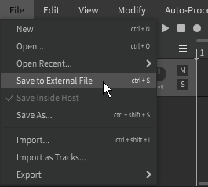
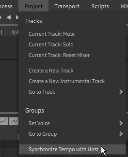
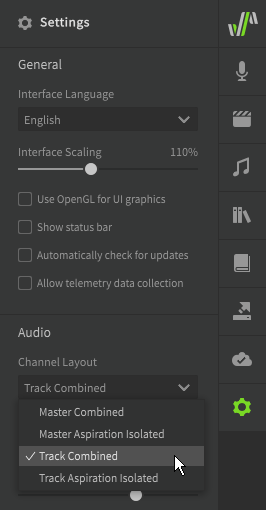

# DAW集成

!!! note "Pro版功能"

    此功能需要Synthesizer V Studio Pro.

您可以在DAW（数字音频工作站）软件中使用Synthesizer V Studio Pro作为VSTi或AudioUnit插件。

有关将插件添加到 DAW 和管理插件输出的说明，请参阅 DAW 的用户手册。

## 保存项目

当Synthesizer V Studio用作 DAW 中的乐器时，会在“文件”顶部菜单下添加其他设置。

如果选择“保存在宿主内部”，则Synthesizer V Studio项目 （SVP） 文件将嵌入到 DAW 项目中。

要将外部 SVP 文件与您的 DAW 项目分开保存，请选择“保存到外部文件”。如果您打算创建项目的 SVP 备份，请确保在保存外部文件后切换回“保存在宿主内部”。

!!! warning "保存到外部文件"

    Synthesizer V Studio 无法区分用户手动的保存和 DAW 执行的自动保存。保存到外部 SVP 时，每当宿主执行任何类型的保存时，SVP 文件都会更新。这是 VST 插件标准的限制。

## 与宿主同步曲速

在“项目”顶部菜单下添加了其他设置。

通过选择“与宿主同步曲速”，速度标记将被添加到Synthesizer V Studio 项目中，与 DAW 项目相匹配。由于 DAW 以多种方式处理曲速变化，因此此功能的行为可能因宿主软件而异。

## 通道布局

Synthesizer V Studio 的输出可以根据在设置面板中选择的选项输出到一个或多个通道。这允许您在使用Synthesizer V Studio 作为插件时对每个轨道应用不同的效果。

主通道 - 合并
: 所有的音频输出均使用单通道。

主通道 - 气声分离
: 使用两个通道，一个用于所有轨道的发声，另一个用于所有轨道的气声隔离。

各音轨 - 合并
: 每个轨道使用一个通道。

各音轨 - 气声分离
: 每个轨道使用两个输出通道，一个用于发声，另一个用于气声隔离。

!!! note

    选择“气声隔离”选项将从主输出中删除气声，产生的输出仅包含基础发声。在这种情况下，必须在混音过程中重新组合以获得完整的结果。

## 视频演示

<iframe width="560" height="315" src="https://www.youtube-nocookie.com/embed/jMm7piaJ0ss" title="YouTube video player" frameborder="0" allowfullscreen></iframe>

## 故障排除

如果插件遇到技术问题，请尝试删除软件并重新安装到默认安装目录。

如果问题仍然存在，请在[官方论坛](https://forum.synthesizerv.com/search)上搜索类似问题或联系[Dreamtonics支持](../support.md).

---

[报告问题](https://github.com/claire-west/svstudio-manual-zh/issues/new?template=report-a-problem.md&title=[Page: DAW Integration])