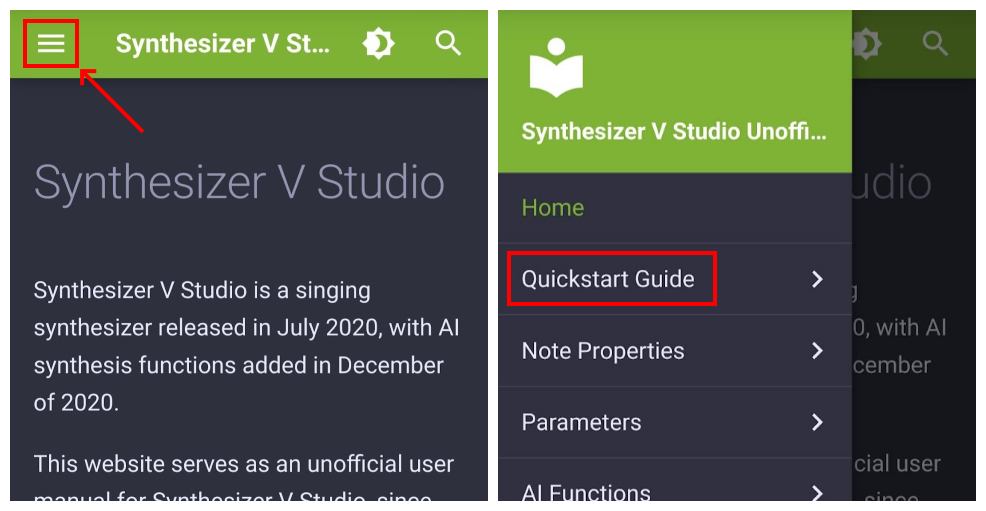
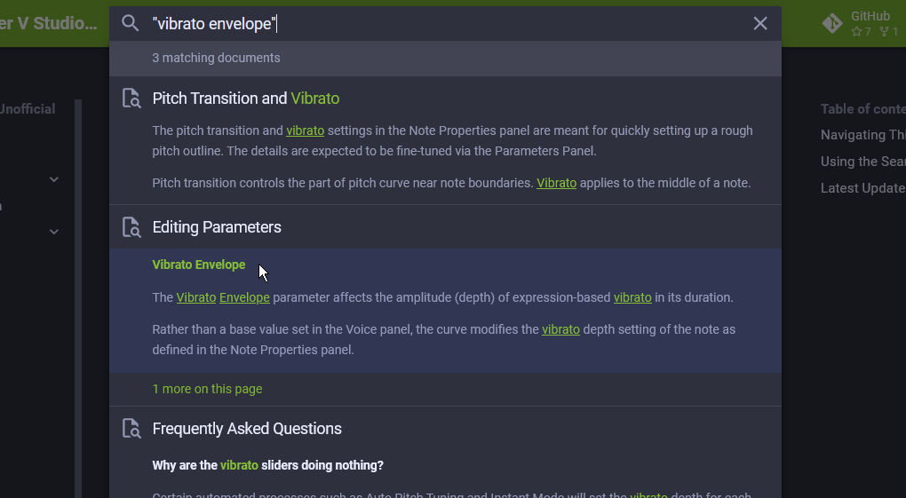

# Synthesizer V Studio

<!--  -->

Synthesizer V Studio是一款于2020年7月发布的歌声合成器,并在2020年12月增加了AI歌声合成功能。

本软件由Dreamtonics与AH-Software联合开发, 支持的歌声数据库由Eclipsed Sounds等许可的第三方开发人员创建。

---

本网站是Synthesizer V Studio的非官方用户手册, 因为[官方手册](https://synthesizerv.com/manual/) 是2018年本软件的旧版本手册。

有关SynthV Studio的官方教学内容，请查看Dreamtonics视频教程系列[(Youtube)](https://www.youtube.com/playlist?list=PLmYtpIFKN5iKaUlB6mRGzFJ0SGRJgRIPz)[(bilibili)](https://www.bilibili.com/video/BV17e411V76q)

本网站不隶属于Dreamtonics。

??? info "1.10.0 更新现已推出！（点击这里获取更多信息）"

    Dreamtonics发布了Synthesizer V Studio版本1.10.0，其中包含基于用户反馈改进的音高模型和一系列 UX 改进。

    有关更新软件的说明，请参阅[安装和激活](setup.md#updating-the-software).

    <iframe width="560" height="315" src="https://www.youtube-nocookie.com/embed/ZKwGR08kCSk" title="YouTube video player" frameborder="0" allowfullscreen></iframe>

    来自Dreamtonics的更新说明：

    * [Synthesizer V Studio 1.10.0 Final Update](https://dreamtonics.com/synthesizer-v-studio-1-10-0-final-update/)

---

## 浏览本网站

本用户手册根据复杂程度分为几个部分。

新用户可先按顺序阅读[快速入门指南](workspace/layout.md)，然后再阅读其他部分。

电脑端用户可使用左侧的菜单栏导航，手机用户可以点击左上角的 (:fontawesome-solid-bars:) 图标来打开导航菜单。

<figure markdown>
  
  <figcaption>在手机上访问导航菜单</figcaption>
</figure>

## 使用搜索功能

如果您正在寻找有关特定功能的信息，搜索功能可以助您更快找到该信息。

单击右上角的“搜索”文本框，（手机端用户请点击放大镜图标）并输入关键字。

在某些情况下，您需要用双引号将搜索词括起来，以便优先考虑与确切短语匹配的结果。

## 最后更新于： <small>({{ git.date.strftime("%Y-%m-%d") }})</small>

[:fontawesome-brands-github: {{ git.short_commit }}](https://github.com/claire-west/svstudio-manual-zh/commit/{{ git.short_commit }})</small> · {{ git.message }}

---

[报告问题](https://github.com/claire-west/svstudio-manual-zh/issues/new?template=report-a-problem.md&title=[Page: Home])
