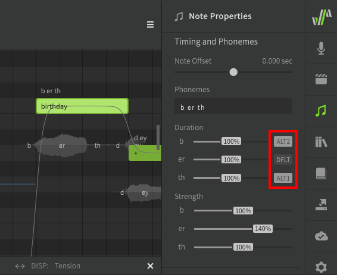
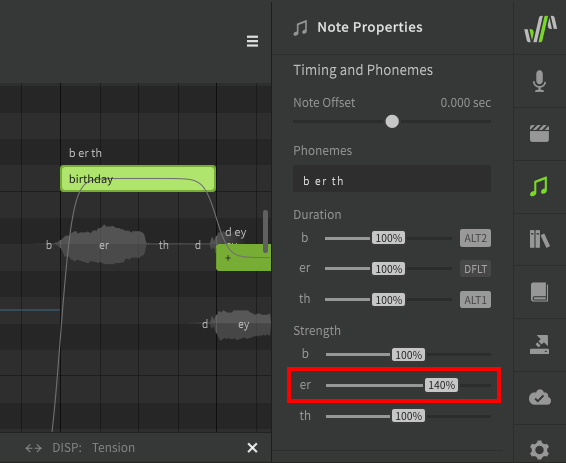

# 备用音素和音素力度

!!! note "Pro版功能"

    以下功能需要Synthesizer V Studio Pro。

备用音素和音素力度位于“音符属性”面板的“时间和音素”部分，可用于自定义每个音素的声音。

## 备用音素

选择备用音素时，渲染过程中将使用不同的发音。此设置的输出因不同歌声数据库而异。

## 音素力度

音素力度（仅限 AI 歌声数据库）将修改音符中单个音素的发音力度。

---

[报告问题](https://github.com/claire-west/svstudio-manual-zh/issues/new?template=report-a-problem.md&title=[Page: Alternate Phonemes])