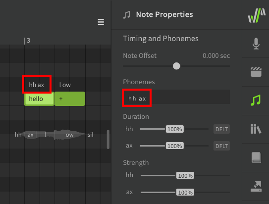
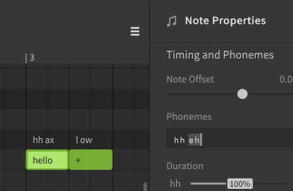
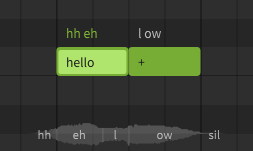
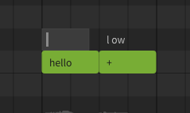
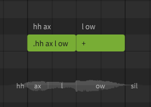
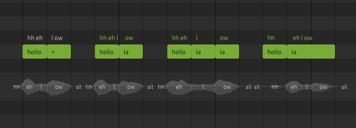
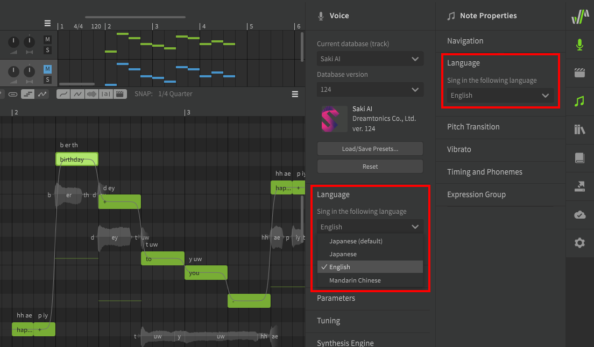

# 编辑音素

音素是构成歌词和音节的发音单元。每个音素代表Synthesizer V Studio能够产生的具体声音（以及每个音素间的过渡声音）。

所有输入到音符中的歌词都会自动转换为音素。渲染合成输出时，音素用于确定适当的发音和时间。

!!! info "提示"

    每个歌词的默认字典映射将为该单词生成最有可能的“正确”发音。

    人类歌手很少能用完美的发音唱歌，所以要达到最自然的效果，经常需要进行音素调整以实现合适的发音。

## 可用音素

每种语言都有自己的一组音素和符号。

每种语言的完整音素列表可以在[音素表](../phonemes.md)页面以及Synthesizer V Studio的安装目录中找到。

|语言|语言表示法|音标|
|---|---|---|
|英语|单词|改良版Arpabet|
|日语|平假名，片假名，罗马音|罗马音派生符号|
|普通话|汉语（简体/繁体），拼音|X-SAMPA|
|粤语|汉语（简体/繁体），粤拼|X-SAMPA|

## 更改音符的音素

音素显示在音符上方，并在选择音符时显示在“音符属性”面板中。

如果音符上方的文本为白色，则表示音符的音素是从音符内输入的歌词自动转换而来的（从已激活的[词典](../advanced/user-dictionaries.md)或默认音素转换）。

有时默认发音与您的歌曲不匹配。例如，根据说话者的口音，“hello”一词的常见发音有可能是`hh ax l ow` 或`hh eh l ow`

双击音符上方的音素文本以输入修改后的音素序列，按++enter++或点击其他区域确认更改，或按++esc++取消更改。

按++tab++以确认更改并前进到下一个音符，按++ctrl+tab++将后退到上一个音符。

您还可以在“音符属性”面板中输入音素，而不是双击音符上方。

手动修改音素序列后，音符上方的文本将为绿色而不是白色。以这种方式手动输入音符的音素时，音符内的歌词将不会对输出产生影响。

若要将音素序列还原为基于歌词的自动转换音素序列，请将音素序列设置为空。

音素序列也可以通过在音符歌词前面加上字符 `.` 来输入音素序列。此格式主要用于向后兼容 .s5p 项目文件，建议在使用 Synthesizer V Studio 时在音符上方输入音素而不是使用此方式。

这种格式可能会干扰软件使用分割音节（`+`）的能力，因为音符中将不再有单词。

## 手动分割音素

虽然`+`和`-`[允许单词在其元音和音节边界上跨越多个音符](../quickstart/entering-lyrics.md)但在某些情况下，您可能希望以更精确的方式分割音符。

手动分配单词的音素可能是[调整时间](note-and-phoneme-timing.md#more-precise-timing-adjustments)或发音的不错方法，由于人类歌手最常在元音和音节分隔处进行过渡，使用此方法时产生请注意避免产生不自然的声音。

此示例演示了与上述相同的歌词 “hello” 使用手动音素输入分配音素给音符。

请注意，在下图第四个示例中，音素不再被视为[音头](note-and-phoneme-timing.md#note-offset)（通常出现在音符开始之前），因为它是分配给其音符的唯一音素。

请记住，如果手动设置了音素序列，则音符内的歌词不再对输出产生任何影响。

## 自定义歌词到音素转换

如果项目中有许多相同单词，则可能需要覆盖该歌词所有位置的默认音素转换。这可以通过创建[用户词典](../advanced/user-dictionaries.md)来实现。

## 跨语言合成

!!! note "Pro版功能"

    跨语言合成功能需要Synthesizer V Studio Pro。

无论其默认语言为何，跨语言合成允许 AI 歌声数据库使用英语、日语、普通话和粤语的音素表，虽然 AI 歌声数据库仍然具有“母语”，但这使他们能够近乎流利地用其他语言演唱。

语言设置可以在“歌声”和“音符属性”面板下找到，分别用于曲目/音符组和单个音符。

---

[报告问题](https://github.com/claire-west/svstudio-manual-zh/issues/new?template=report-a-problem.md&title=[Page: Editing Phonemes])