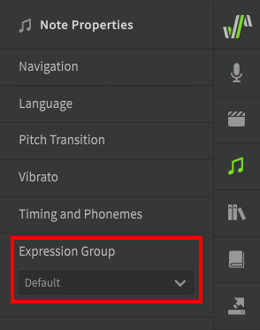
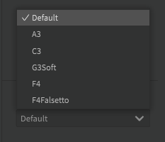
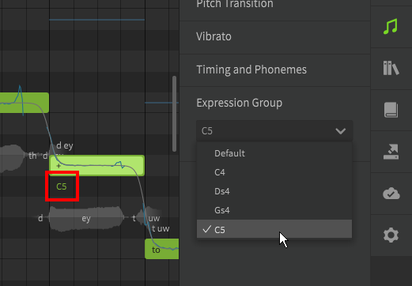

# 表现力分组

表现力分组下拉列表位于“音符属性”面板的底部。

!!! info "表现力分组仅适用于非AI歌手"

## 选择表现力分组
非AI歌声数据库包括在不同音阶上录制的同一组样本，有时具有不同的声线。

默认情况下，将自动为每个音符选择最合适的分组，但您可以手动选择所需的表现力分组。每个歌声数据库的可用表现力分组将有所不同。

当手动选择表现力分组时，它将在钢琴卷帘中的音符下方显示。

---

[报告问题](https://github.com/claire-west/svstudio-manual-zh/issues/new?template=report-a-problem.md&title=[Page: Expression Groups])