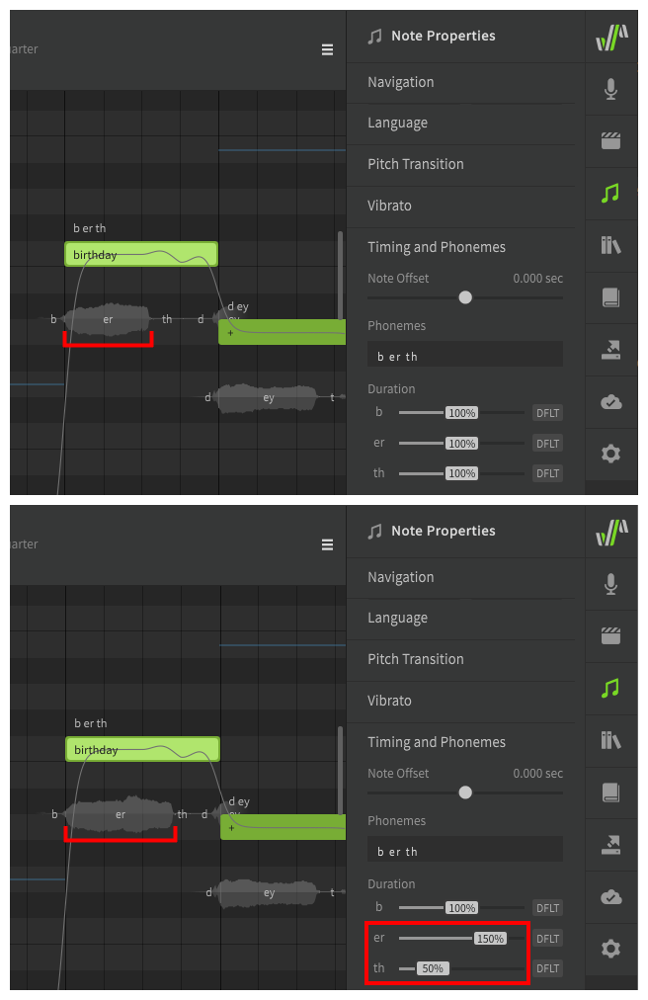
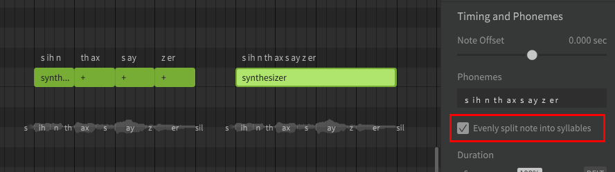
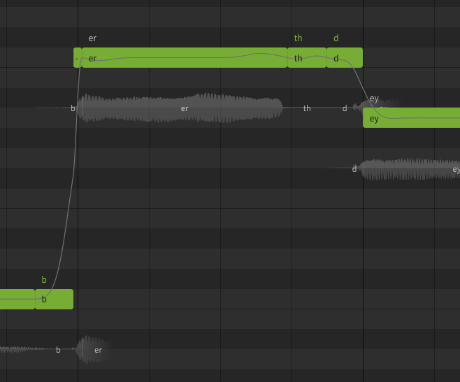

# 时间和音素

“时间和音素”属性允许您调整音符内音素的分布或持续时间，或者调整整个音符相对于其相邻音符的分布或持续时间。

## 音符偏移

音符偏移滑块会将所选音符的开头提前或推迟最多 0.1 秒，并将适当调整相邻音素时长。

!!! note "注意"

    如果音符以辅音开头，则音符的第一个音素可能会在音符本身之前开始。这样做是为了模仿人类歌手在歌词之间的过渡方式，被称为“音头”。

## 音素时长

默认音素计时根据音素的类型（元音、停止音、摩擦音等）确定。音符内音素（以及相对于其相邻音素）的时长分布可以在此默认值的 20% 到 180% 之间修改。

!!! note "注意"

    一般来说，不在同一音符中包含多个音节更容易控制时间。使用`+`将[歌词的音节分割](../quickstart/entering-lyrics.md)，或[手动分配音素](editing-phonemes.md#separating-words-in-unique-ways)给多个音符。

### 按音符长度均匀分配音节

当启用“按音符长度均匀分配音节”时，在单个音符中输入的多音节歌词将被视为一系列分别包含每个音节的等长音符。

这适用于在音符持续时间内音高不变并且每个音节具有相同持续时长的多音节单词。不符合此标准的歌词应使用音节分隔符 (`+`)将其音节分成多个音符。

请注意，在此示例中，单词“synthesizer”的每个音节的持续时长完全相同。

### 更精确的定时

如果音素时长滑块不能提供足够的精度，或者需要将计时调整到 20%-180% 范围之外，则需要将每个音素分离到独自的音符中。

如果音符只有一个音素，则音素的持续时间将与音符边界对齐，并不与于具有较长音素序列的音符的音头或时长相似。

请记住，如果所有音符都对齐到网格，可能会导致声音不自然且过度量化。

---

[报告问题](https://github.com/claire-west/svstudio-manual-zh/issues/new?template=report-a-problem.md&title=[Page: Phoneme Timing])