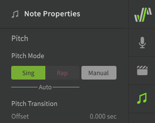

# 音高转变和颤音

音高转变和颤音用于在音符间创建更自然的过渡，而不严格遵守音符的音高。

根据所选音高模式的不同，修改音高转变和颤音的选项也将有所不同。

## 音高模式

“音高模式”设置有三个选项，可以在至少选择一个音符时从“音符属性”面板中选择这些选项。

有关使用快捷键一次选择多个音符的方法，请参阅[编辑音符](../quickstart/editing-notes.md#selecting-notes)。

**歌唱**
: 将 AI 生成的音高偏差添加到音符中，这些音符经过建模产生逼真的过渡，延音和颤音。[更多关于音高模式：歌唱](../ai-functions/pitch-mode-sing.md)。

**说唱**
: 将 AI 生成的音高偏差添加到您的音符中，这些音符经过建模以模仿人类说唱，并允许使用“说唱音高”参数。[更多关于音高模式：说唱](../ai-functions/pitch-mode-rap.md).

**手动**
: 提供对音高的完全手动控制。默认情况下，音符不会有音高偏差，因此需要用户手动控制。
: 当按钮为暗色时，说明手动模式已关闭。当它为亮色时，说明手动模式已启用。[更多关于手动音高模式](../advanced/pitch-mode-manual.md)

---

[报告问题](https://github.com/claire-west/svstudio-manual-zh/issues/new?template=report-a-problem.md&title=[Page: Transition and Vibrato])