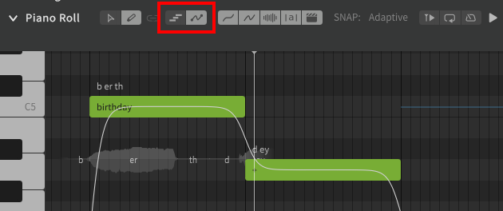
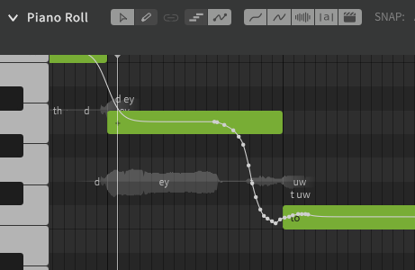

# 直接编辑音高偏差

[音高偏差](editing-parameters.md)参数可以直接在钢琴卷帘中编辑。

虽然可以通过参数面板修改音高偏差，但直接在钢琴卷帘中进行编辑可以让您修改实际的音高值，而不仅仅是附加层。

## 更改到直接编辑音高模式

从钢琴卷帘的顶部选择直接音高编辑模式。

自由手绘工具可用于直接在钢琴卷帘上绘制音高偏差。

选择多功能编辑工具可以像在参数面板中一样创建和拖动点。

### 简化参数

简化参数选项可以在“修改”顶部菜单下找到（默认 ++alt+s++）.

此选项可减少选区中的点数以使曲线平滑，但生成的曲线可能与原始曲线不完全匹配。

## 视频演示

<iframe width="560" height="315" src="https://www.youtube-nocookie.com/embed/KwIWwpoxTiY" title="YouTube video player" frameborder="0" allowfullscreen></iframe>

---

[报告问题](https://github.com/claire-west/svstudio-manual-zh/issues/new?template=report-a-problem.md&title=[Page: Direct Pitch Editing])