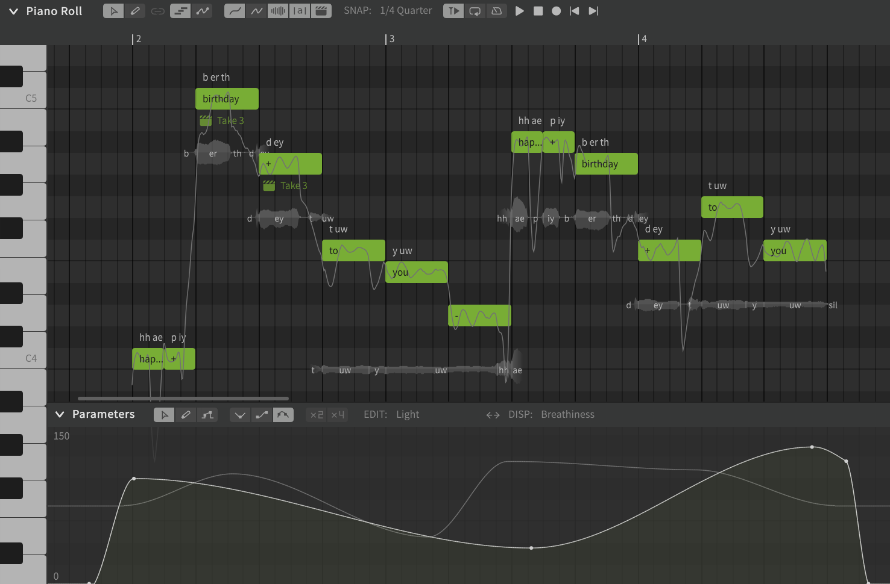
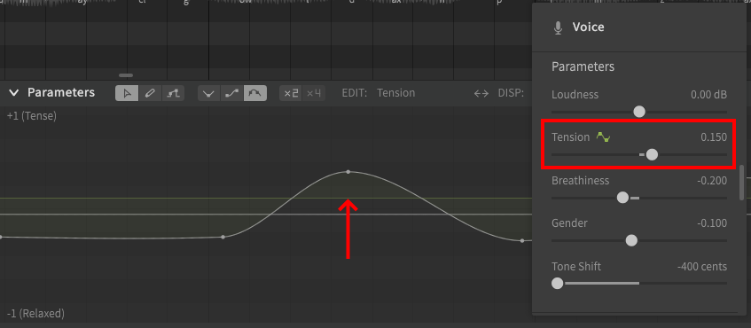

# 编辑参数

参数提供对人声轨道各个方面细节的手动控制

## 参数类型

**音高偏差**
: 在基本音高曲线上添加音高偏移，100音分相当于一个半音。

**颤音包络**
: 颤音的调幅

**响度**
: 声音的大小

**张力**
: 声音的紧张和放松。

**气声**
: 气流声大小

**发声**
: 正常发声到耳语间的变化

**性别**
: 偏男性声音到偏女性声音间的变化

**音区偏移** (仅限AI声库)
: 真声到假声间的变化

!!! note "Pro版功能 - 音区偏移仅可在Synthesizer V Studio Pro中使用。"

**声线参数** (AI voice databases only)
: 更改[声线参数](../ai-functions/vocal-modes.md)。
: 每个AI歌声数据库都有不同的声线参数，每个声线参数都可分别调整。

!!! note "Pro版功能 - 声线参数仅可在Synthesizer V Studio Pro中使用。"

### 举个栗子

在这个例子中，SOLARIA的“Light”声线参数和气声参数在歌声的持续时间内被修改。

曲线在给定时间点的垂直位置决定了该时刻其各自参数或声线参数的值。例如，前景中显示的“Light”声线参数曲线在歌词开始时约为 105%，然后缓慢下降到 30% 左右，在歌词末尾附近逐渐增加到大约 135%。

!!! note

    参数曲线与其沿时间轴的水平位置相关，而不是与同一时间点的音符相关。

    这意味着移动、复制或分组音符序列不会包含该序列持续时间内的参数值，除非您使用[选择音符参数](#select-parameters-for-notes) 功能来选择它们。

    某些参数（例如音高偏差）将特定于它们所排列的音符，因此应与其各自的音符一起移动/复制/分组。其他参数（例如声线参数）通常应用于整个乐句，因此将这些曲线与特定音符一起移动可能并不常用。

## 基础值

大多数参数的基值可以在“歌声”面板中设置。参数面板中的曲线将修改此基础设置的值。

### 基值标志

为当前正在编辑的参数设置基值时，绿色水平线将位于基值位置。

### 颤音包络

颤音包络参数会影响颤音振幅（深度）和持续时间。

该曲线没有在“歌声”面板中设置的基值，而是在使用“手动音高模式”时音符的颤音深度设置，或者在使用“音高模式：歌唱”时音符的颤音调制（仅限Pro版）设置。

### 说唱音高

说唱音高参数提供了一个图形工具，用于编辑使用[音高模式：说唱](../ai-functions/pitch-mode-rap.md#the-rap-intonation-parameter)的音符特定于模式的设置。

此参数始终基于单个音符进行设置，因此“歌声”面板中没有关联的默认值。

## 编辑参数曲线

### 选择参数

单击“EDIT”标签将打开参数选择下拉列表

当前选定的参数将用对勾标记表示，任何关联曲线的参数将以绿色表示。

选择一个基本参数或[声线参数](../ai-functions/vocal-modes.md)以编辑此参数。

### 多功能编辑工具（基于点）

所有参数曲线都由点（有时称为“节点”）和连接它们的线组成。

多功能编辑工具(++alt+1++)可以添加和移动点，一般用于创建平滑曲线和对现有曲线进行调整。

双击以添加点

多功能选择工具还可以选择点并移动它们，就像钢琴卷帘中的音符一样。

#### 节点移动快捷键

可以按住快捷键来更改使用鼠标拖动点的行为。

|快捷键|行为|
|---|---|
|++shift++|仅垂直移动|
|++ctrl++|仅水平移动|
|++shift+ctrl++|无自动对齐|

### 自由手绘工具

自由手绘工具(++alt+2++)允许您在使用光标绘制时单击并按住鼠标左键直接绘制曲线。

这可用于自定义音高转变、绘制独特的颤音或引入各种音高偏差等以实现您想要的演唱风格。

按住右键单击将清除鼠标经过的区域上的任何曲线。

### 直线工具

直线工具(++alt+3++)将在鼠标绘制的线的两端引入两个点。

如果所绘制线的任一端靠近现有点，则现有点将移动到直线开始或结束的位置。

### 曲线类型

曲线类型设置可更改点之间曲线的插值方式。

第一个（线性）将在点之间绘制直线。

第二个（余弦）将确保在向相邻点弯曲之前在点的两侧有一条水平线。

第三种（自适应样条）将产生连接每个点的最平滑曲线。

<figure markdown>
  
  <figcaption>A comparison of interpolation types</figcaption>
</figure>

### 参数指示器

任何关联曲线的参数都将在“歌声”面板中显示一个参数指示器，以提醒该参数的参数曲线已被修改。

参数的实际值（基值加参数曲线）将根据当前播放头位置显示在“歌声”面板的滑块上，并反映播放过程中参数的实时值。

## 更多功能

可以在“设置”面板的“编辑器”部分找到用于参数编辑的其他选项。

在自由手绘模式下隐藏控制点
: 选择自由手绘工具后，所有点将被隐藏。

自动插入锚点
: 如果在音符的持续时间内放置了一个点，并且附近没有其他点，则将在音符之前和之后自动放置锚点。

简化自由手绘的曲线
: 自动简化使用自由手绘工具绘制的曲线。这将减少点数并可能提高性能，但也可能导致曲线无法精确地遵循手绘线。

吸附控制点到零点位置
: 如果需要将点移动到接近0的位置，则可能需要禁用。

### 选择音符对应的参数

“选择音符对应的参数”选项可以在“编辑”顶部菜单下找到，也可以右键单击选定的音符。

此选项将为当前选定的音符选择包含所有参数类型的参数点，即使它们在“参数”面板中暂未显示。

这常用于复制或为音符编组时保留关联的参数曲线。

有关使用快捷键一次选择多个音符的方法，请参阅[编辑音符](../quickstart/editing-notes.md#selecting-notes)。

### 简化参数

简化参数选项可以在“修改”顶部菜单下找到（默认 ++alt+s++）。

此选项会减少选区中的点数以创建平滑曲线，但生成的曲线可能与原始曲线不完全匹配。

## 视频演示

<iframe width="560" height="315" src="https://www.youtube-nocookie.com/embed/agSYwd_LQZU" title="YouTube video player" frameborder="0" allowfullscreen></iframe>

---

[报告问题](https://github.com/claire-west/svstudio-manual-zh/issues/new?template=report-a-problem.md&title=[Page: Editing Parameters])