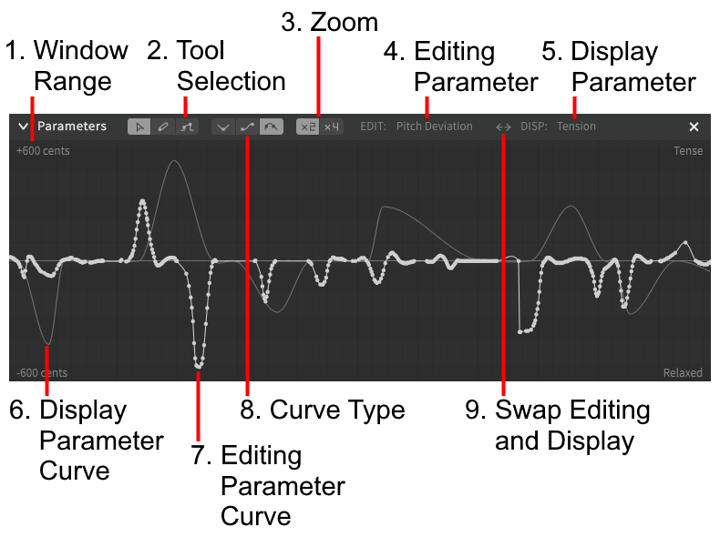
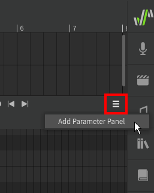
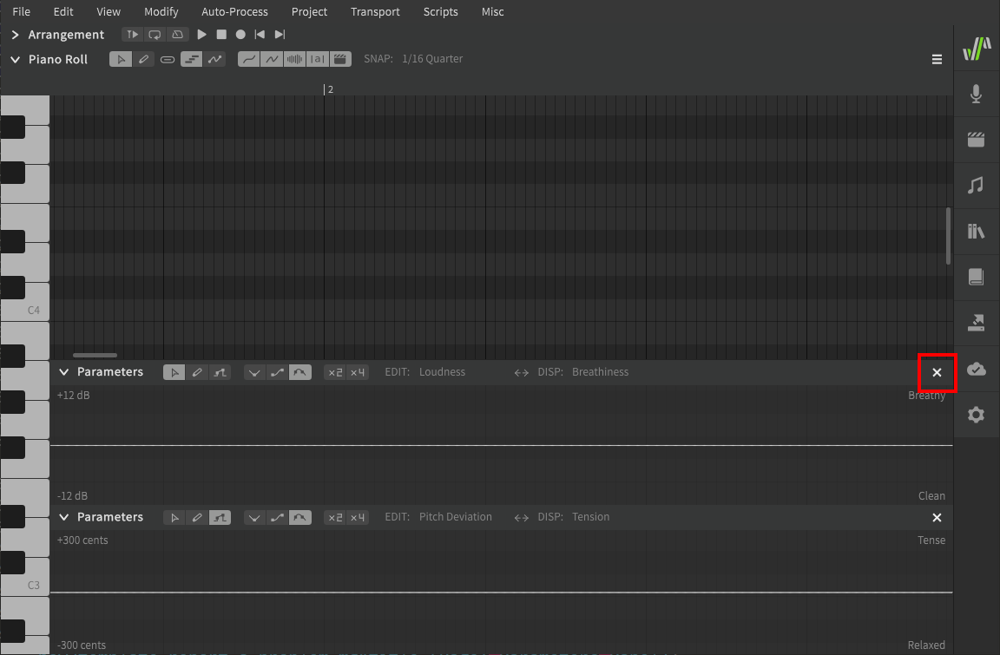

# 参数面板

### 1. 窗口范围
当前选定参数的最小和最大范围指示器。

### 2. 工具选择
在多功能编辑工具，自由手绘工具和直线工具间切换

### 3. 缩放
将窗口范围乘以 2 或 4 倍。并非所有参数都可以缩放。

都为暗色（即为一倍）是值域最小的，而4倍是值域最大的。

### 4. 当前正在编辑的参数
在参数面板中正在编辑的参数。

### 5. 对照参数
显示在当前编辑参数后面以供参考的参数。

### 6. 对照参数曲线
所选对照参数的曲线。

### 7. 编辑参数曲线
当前正在编辑的参数曲线。

### 8. 曲线类型
选择在关键点间的曲线类型。

### 9. 交换编辑参数和对照参数
交换编辑参数（亮色）和对照参数（暗色）。

## 多个参数面板

可以使用钢琴卷帘右上角的图标增加参数面板。

也可以点击 ✖ 来关闭不需要的参数面板

---

[报告问题](https://github.com/claire-west/svstudio-manual-zh/issues/new?template=report-a-problem.md&title=[Page: Parameters Panel])