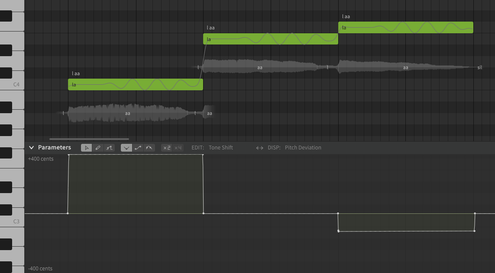

# 音区偏移

!!! note "Pro版功能"

    以下功能需要Synthesizer V Studio Pro.

!!! info "译者注"

    以下内容可简要理解为此参数越低，歌手越偏向于使用假声，参数越高，越偏向于使用真声。

音区偏移是一个[参数](editing-parameters.md)，允许在不改变音高的情况下修改音符的音调。

渲染的输出将具有一种音调，就好像音符与音高线不同一样，其偏移量为音区偏移参数在该时间点的值。音区偏移仅适用于AI歌声数据库。

在下面的示例中，音符的音高为 C4、E4 和 F4，音区偏移参数与音符完全对齐。前两个音符相隔400音分，后两个音符相距100音分。为了匹配这一点，使用的音区偏移设置约为 +400 音分、0 和 -100 音分。

在渲染过程中，音符的音高为 C4、E4 和 F4（如钢琴卷帘中的音高线所示，由于颤音而有一些细微的变化），但是由于音区偏移，三个音符都按照 E4 的音调计算。

这有助于缓解任何音调不一致（或引入更多音调变化）的情况，而无需修改渲染输出的音高。

!!! info "提示"

    音区偏移的效果将根据所选的歌声数据库和音符的音高而有所不同，因为每个歌手的音调在不同的范围内是不同的。

---

[报告问题](https://github.com/claire-west/svstudio-manual-zh/issues/new?template=report-a-problem.md&title=[Page: Tone Shift])