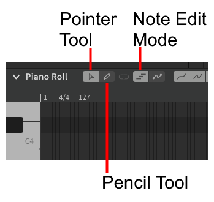
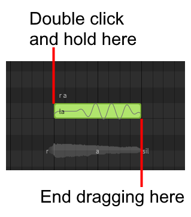
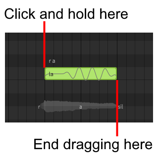

# 添加音符

音符的添加因所选工具而行为不同。通常，多功能编辑工具更适合编辑音符，而自由手绘工具更适合添加新音符。在添加音符之前，请确保您选择的是音符编辑模式。

## 多功能编辑工具
当使用多功能编辑工具(++alt+1++)时，双击（第二次点击后不松开左键）并在钢琴卷帘中拖动以创建所需长度的音符。

## 自由手绘工具

当使用自由手绘工具(++alt+2++)时，在钢琴卷帘中的任意位置拖动以创建所需长度的音符。

## 视频演示

<iframe width="560" height="315" src="https://www.youtube-nocookie.com/embed/_s1gITI3vbA" title="YouTube video player" frameborder="0" allowfullscreen></iframe>

---

[报告问题](https://github.com/claire-west/svstudio-manual-zh/issues/new?template=report-a-problem.md&title=[Page: Creating Notes])