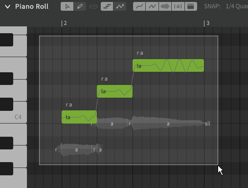
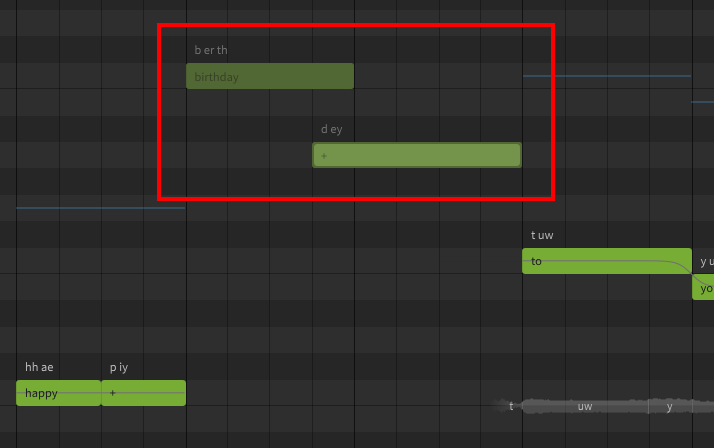
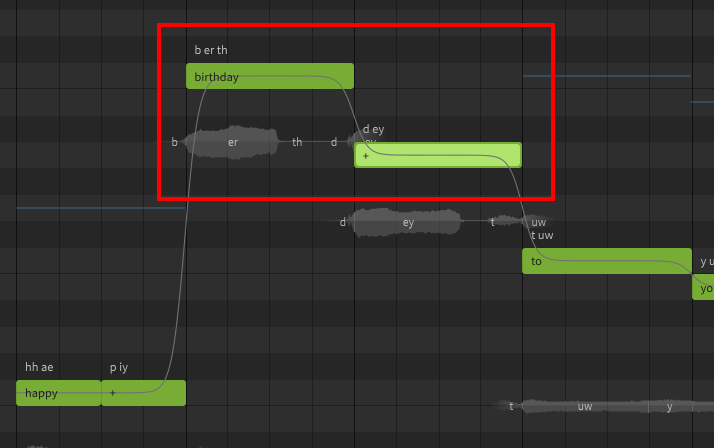
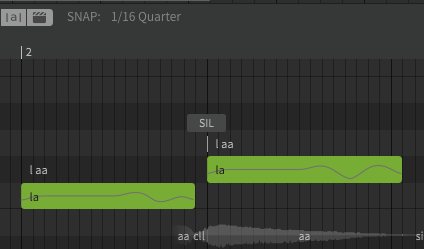
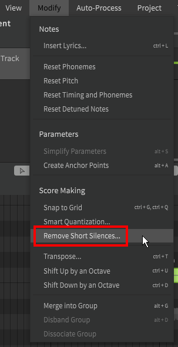

# 编辑音符

音符的编辑因所选工具而异，请在修改音符之前确认您处于音符编辑模式。

## 选择音符

音符可以通过单击被选中。

要一次选择多个音符，请使用多功能编辑工具(++alt+1++)以在要选择的音符周围拖动一个边界框。

可使用 ++ctrl+a++ 选择当前轨道中的所有音符。

还可以在已选中多个音符的同时按住++ctrl++，并单击已选中的音符来取消选中。

可以通过选中一个音符后按住++shift++，并单击另外一个音符以选中在这之间的所有音符。

还可以在使用多功能手绘工具(++alt+2++)时，双击（第二次点击后不松开左键）并拖动框选来选择音符。这类似于使用多功能编辑工具添加[音符](creating-notes.md#pointer-tool)的操作。

## 修改音符

可以通过单击并拖动音符来移动音符。如果选择了多个音符，则将整体拖动。

要更改音符的时长，请单击并按住音符的头部或尾部（左边缘或右边缘），然后拖动到所需的长度。

### 音符移动快捷键

可以按住快捷键来更改拖动音符时的行为。

|快捷键|行为|
|---|---|
|++shift++|仅垂直移动|
|++ctrl++|仅水平移动|
|++ctrl+alt++|不与网格对齐|

## 音符重叠

重叠的音符不会输出且将被禁用，并不会产生任何声音。

调整音符大小，使其不重叠，输出将会恢复。

## 短间隙

一个音符的结尾通常应与下一个音符的开头相吻合，除非在其间有意保持沉默。

如果两个音符之间存在较小的间隙（1/16拍或更小），将会显示`SIL`（静音）指示器。

单击`SIL`指示器将自动填补间隙。

也可以通过顶部“修改”菜单一次从多个音符间删除短间隙。

## 视频演示

<iframe width="560" height="315" src="https://www.youtube-nocookie.com/embed/_s1gITI3vbA" title="YouTube video player" frameborder="0" allowfullscreen></iframe>

---

[报告问题](https://github.com/claire-west/svstudio-manual-zh/issues/new?template=report-a-problem.md&title=[Page: Editing Notes])