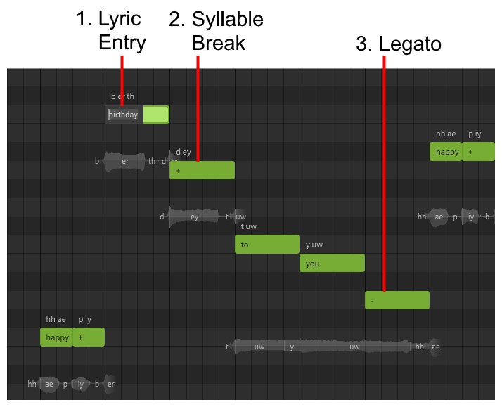
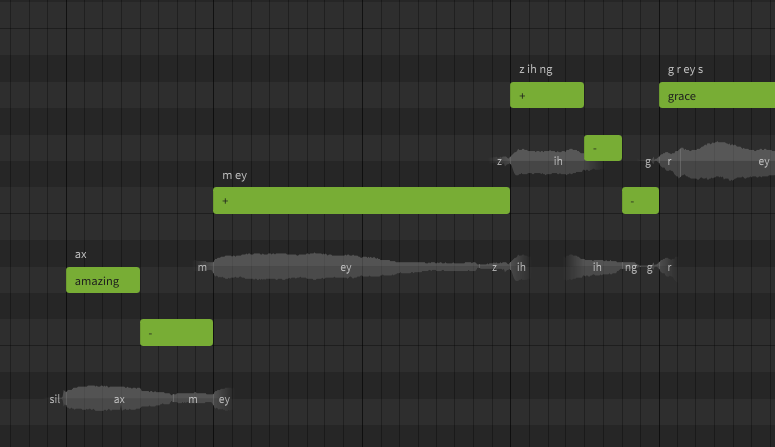
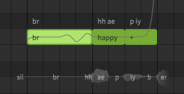
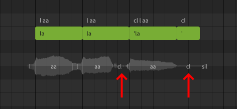

# 输入歌词

### 1. 歌词输入
双击音符以输入歌词，按++enter++以完成更改，或按++esc++以取消更改。

按++tab++以确认更改并前进到下一个音符，按++ctrl+tab++将后退到上一个音符。

### 2. 音节分割
使用加号(`+`)以将多音节单词分布在多个音符上。

!!! 注意

    通常，最佳做法是每个音符不要包含一个以上的音节。使用英语时，使用音节分割字符较为常见。

    使用日语或中文时，每个音符通常只有一个音节，因此通常不需要分割音节。

### 3. 延音
使用减号(`-`)将最后一个唱出的元音延续到下一个音符中。

## 同时使用音节分割和延音
多音节单词和旋律可能需要音节分割(`+`)和延音(`-`)同时使用。

在这个例子中，单词"amazing"的三个音节扩展到了六个音符。

|音符|歌词/符号|音节|
|---|---|---|
|1|amazing|第一|
|2|`-` （减号）|第一（延音）|
|3|`+` （加号）|第二|
|4|`+` （减号）|第三|
|5|`-` （减号）|第三（延音）|
|6|`-` （减号）|第三（延音）|

## 添加换气声
换气声可以通过输入`br`歌词来添加（仅限AI歌手）。

## 添加喉塞音
可以使用单引号(`'`)来在音符之间添加喉塞音，仅包含单引号的音符可用于在歌词末尾添加喉塞音。

## 调整发音

人类歌手很少能用完美的发音演唱每句歌词，因此输入歌词的默认发音并不总是会产生预期的结果。

完成快速入门部分后，建议学习[编辑音素](../note-properties/editing-phonemes.md)来在必要时获得所需的发音。

## 视频演示

<iframe width="560" height="315" src="https://www.youtube-nocookie.com/embed/Gj7UipbHBdw" title="YouTube video player" frameborder="0" allowfullscreen></iframe>

---

[报告问题](https://github.com/claire-west/svstudio-manual-zh/issues/new?template=report-a-problem.md&title=[Page: Entering Lyrics])