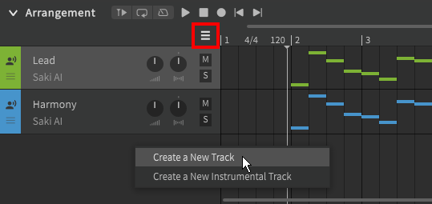
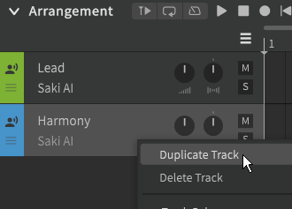
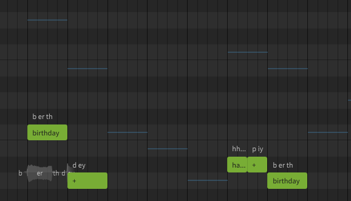
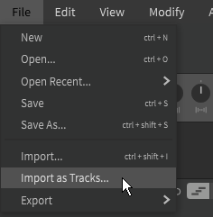

# 管理音轨

音轨显示在[编曲](../workspace/arrangement.md)面板中。

## 创建轨道

有多种方法可以添加新音轨：

- 点击时间轴左侧(:fontawesome-solid-bars:)图标
- 右键单击现有轨道下方的空白区域
- 从应用程序窗口顶部的“项目”菜单
- 将伴奏(wav 或 flac 格式)文件拖进编曲栏

!!! note "Pro版功能 - 轨道数量限制"

    Synthesizer V Studio Basic最多只能同时存在3个轨道，Pro版取消了该限制。

!!! warning

    使用mp3格式的乐器文件可能会导致音频不同步。

选择“创建新的音轨”会将新的人声轨道添加到列表底部，默认情况下不会选择歌声数据库。轨道颜色将根据已使用的颜色自动分配。

选择“创建新的伴奏轨”将自动提示选择音频文件。每个伴奏轨道只能包含一个音频文件。

双击轨道名称以重命名。

右键轨道以复制或删除它，与新轨道不同，复制的轨道将具有与原轨道相同的轨道颜色。

其他音轨的音符将在钢琴卷中显示为彩色线条。这可以通过应用程序窗口顶部“查看”菜单中的“显示其他音轨的旋律”选项禁用。

## 导入音轨

应用程序顶部的“文件”菜单中有两个选项允许导入音轨。

"导入" (++ctrl+shift+i++)将在Synthesizer V Studio 中将所选文件作为新项目打开。“导入为音轨”将根据所选文件在当前项目中创建新轨道。

您可以使用这些方法加载包含歌曲的人声旋律的 MIDI 文件，或从其他歌声合成器导入项目文件。

支持的文件类型包括 MIDI、UST、VSQx、VPR 和 CCS。

“导入为音轨”功能还支持SVP和S5P文件，以允许合并Synthesizer V项目。

### 导入曲速和拍号标记

“导入”功能还将根据原始文件应用速度和拍号标记。

“导入为音轨”不会修改当前项目的速度或拍号标记。

要将 MIDI 速度图应用于现有项目：

1. 如果您有任何未保存的更改，请保存您的工作。
2. 使用“导入”基于您的 MIDI 文件创建新项目。新项目的速度和拍号标记将对映 MIDI 文件的速度和拍号标记。
3. 使用“导入为音轨”将现有的 SVP 文件合并到新项目中。
4. 使用新名称保存新项目。

!!! info "某些 DAW 和制谱程序在导出 MIDI 文件时不包含速度或拍号信息。"

!!! warning

    Synthesizer V Studio 和 MIDI 文件格式都不支持曲速渐变。

    要与伴奏同步，请确保在两个轨道中以瞬时或逐步方式应用曲速变化，并且所有曲速变化都在一拍的开始。

## 视频演示

<iframe width="560" height="315" src="https://www.youtube-nocookie.com/embed/sz1TwwXmMJA" title="YouTube video player" frameborder="0" allowfullscreen></iframe>

---

[报告问题](https://github.com/claire-west/svstudio-manual-zh/issues/new?template=report-a-problem.md&title=[Page: Managing Tracks])