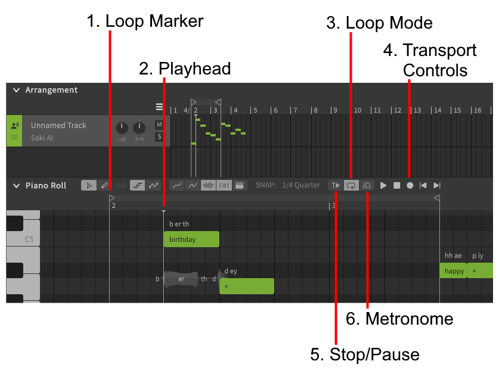
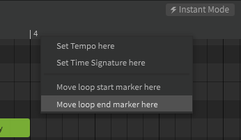

# 播放控件

### 1. 循环标记
启用循环播放后，时间轴上将显示两个循环标记，指示循环部分的开始和结束。

这些循环标记可以用鼠标拖动，也可以通过右键单击移动到时间轴上的任意点。在禁用循环时创建循环标记将启用循环。

### 2. 播放头
当前播放位置，可以通过左键单击时间轴来移动播放头。

### 3. 循环模式
启用或禁用循环播放，并相应地显示或隐藏循环标记。

### 4. 播放控制
用于播放、停止、跳到开始和跳到结束的控件。

可以使用空格键触发播放。如果播放正在进行，空格键将停止或暂停播放。

如果启用了循环播放，则跳到开始/结束将导航到循环标记，而不是轨道开始/结束。

!!! note "Pro版功能 - MIDI录音"

    播放控件还包含一个录制按钮，该按钮允许使用 MIDI 控制器将音符输入钢琴卷帘。

### 5. 停止/暂停
禁用（深色）时，使用“停止”行为，停止播放时播放头返回到原位置

启用后（浅色）使用“暂停”行为，停止播放时播放头将保留在当前位置，而不是返回到播放开始时的位置。

### 6. 节拍器
!!! note "Pro版功能 - MIDI录音"

    启用或禁用在 MIDI 设备录制期间播放节拍。

    通常节拍器声音只会在 MIDI 录制期间播放，但可以使用“设置”面板中的“播放期间禁用节拍器”选项在常规播放时发出声音。

---

[报告问题](https://github.com/claire-west/svstudio-manual-zh/issues/new?template=report-a-problem.md&title=[Page: Playback])