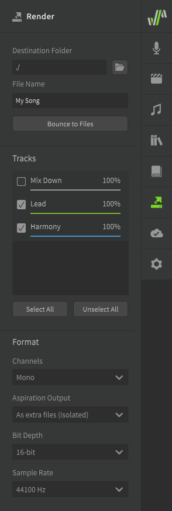

# 导出音乐

音频输出可以通过“渲染”面板导出到 wav 文件，该面板可从侧面板访问。

为您的文件命名，选择要渲染的轨道，然后点击“导出为文件”以 wav 格式导出。

您可更改其他格式设置，例如位深度和采样率。

!!! note "Pro版功能 - 气声输出"

    Synthesizer V Studio Pro 可以分离并以单独的文件导出气声。然后，可以在您的 DAW 中以不同的方式对气声混音，或者在使用 DAW 时作为参考。

    选择“分离气声”选项将从音轨/文件中删除气声，从而生成仅包含发声（声带产生的声音）的音频文件。在这种情况下，必须重新合成文件才能获得完整歌声。

## 导出

<iframe width="560" height="315" src="https://www.youtube-nocookie.com/embed/upBn5tuzBg0" title="YouTube video player" frameborder="0" allowfullscreen></iframe>

---

[报告问题](https://github.com/claire-west/svstudio-manual-zh/issues/new?template=report-a-problem.md&title=[Page: Saving the Audio])