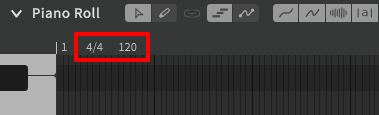
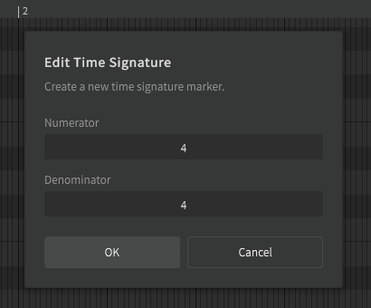
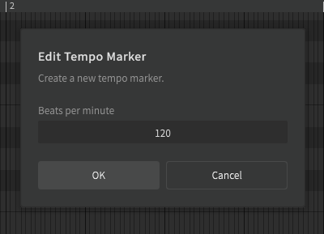
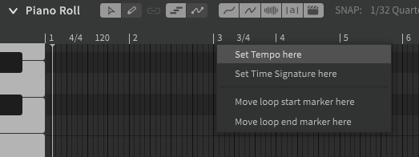

# 设置拍号和曲速

拍号和曲速（BPM）标记显示在编曲栏和钢琴卷帘上方的时间轴。

要修改标记，请双击它。要删除标记（不包括第一小节处的标记），请右键单击它并选择“删除”。

可以通过右键时间轴单击来添加任一类型的新标记。也可以通过双击时间轴来添加曲速标记。

曲速标记最短只能以四分之一小节间隔创建，并且只能在小节开始时更改拍号。

!!! warning

    Synthesizer V Studio 和 MIDI 文件格式都不支持曲速渐变。

    要与伴奏同步，请确保在两个轨道中以瞬时或逐步方式应用曲速变化，并且所有曲速变化都在一拍的开始。

---

[报告问题](https://github.com/claire-west/svstudio-manual-zh/issues/new?template=report-a-problem.md&title=[Page: Setting up the Score])