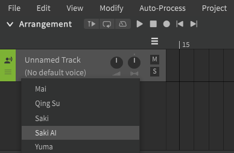
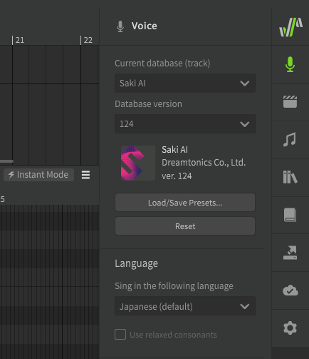

# 选择歌手

默认情况下，不会为新轨道选择任何歌手。

请从编曲面板的下拉列表中选择一个歌手。

您也可以从“歌声”面板中选择歌手。在此处您可以选择特定版本的歌声数据库（如果安装了多个）。

!!! note "Pro版功能 - 跨语言合成"

    如果选择了 AI 歌手，您可以为歌曲选择适当的语言。AI歌声数据库具有默认语言，但也可以利用跨语言合成功能来使用其他语言，目前支持日语、英语、普通话和粤语。

---

[报告问题](https://github.com/claire-west/svstudio-manual-zh/issues/new?template=report-a-problem.md&title=[Page: Singer Selection])