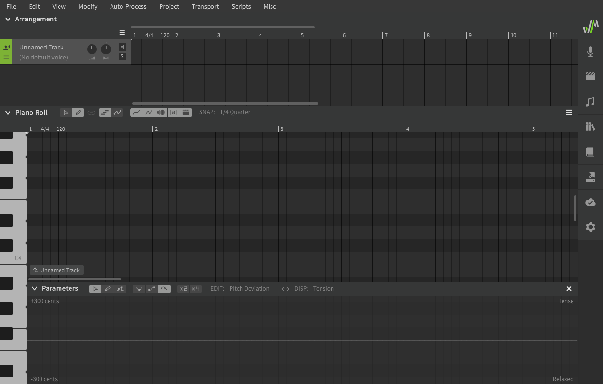
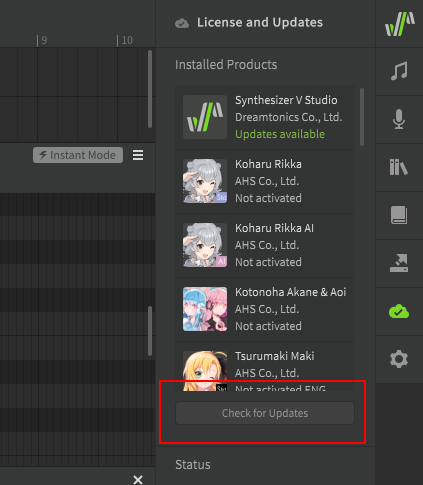
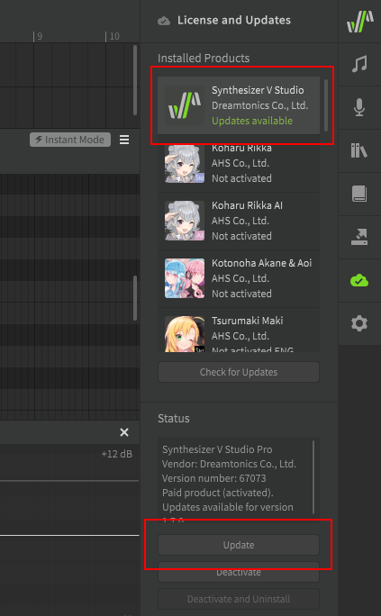
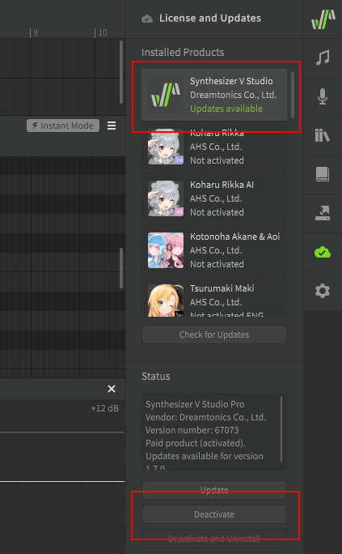

# 安装和激活

## 下载

Synthesizer V Studio Basic版和Pro版的下载链接可以在[Dreamtonics官方网站](https://dreamtonics.com/en/synthesizerv/)找到。

购买Pro版后，您将会收到一封包含下载说明的邮件，这些说明可能因您购买的供应商而异。

!!! warning "警告"

    请始终保存您的此封邮件，并妥善保存您的产品激活码，您的供应商并不保证能恢复丢失或泄露的激活码。

## 安装 (Windows & Mac)

双击运行安装程序（在Windows 上为.exe格式，在 Mac 上为.pkg格式，或选中文件并按 ++enter++。然后按照屏幕上的说明操作。

如果成功安装专业版，则应用程序启动时将提示您输入产品激活码。

成功安装（并激活）后，您将看到以下的应用程序窗口。



### 安装歌声数据库

要安装歌声数据库，请双击 .svpk 文件或将其从文件浏览器拖放到 Synthesizer V Studio 窗口中。然后将显示歌声数据库安装对话框，请按照屏幕上的说明操作。

如果安装付费歌声数据库，安装后系统将提示您输入产品激活码。

成功安装（并激活）后，您将可以在歌手选择下拉列表中找到此歌手。


## 安装 (Linux)

切换到将要安装的目录并解压缩下载的压缩文件 (`~`)，您可能需要以root身份运行`unzip`(即使用`sudo`) 在此示例中，Synthesizer V Studio将被解压到`/opt`:

=== "Pro版"
    ```
    cd /opt
    sudo unzip ~/Downloads/svstudio-pro-linux64.zip
    ```

=== "Basic版"
    ```
    cd /opt
    sudo unzip ~/Downloads/svstudio-basic-linux64.zip
    ```

如果解压缩到主目录之外的位置，则可能还需要修改文件权限。此示例适用于大多数情况：

=== "Pro版"
    ```
    sudo chown -R $(whoami):$(whoami) "Synthesizer V Studio Pro"
    ```

=== "Basic版"
    ```
    sudo chown -R $(whoami):$(whoami) "Synthesizer V Studio Basic"
    ```

您可从终端运行synthv-studio来启动程序。

=== "Pro版"
    ```
    cd "Synthesizer V Studio Pro"
    ./synthv-studio
    ```

=== "Basic版"
    ```
    cd "Synthesizer V Studio Basic"
    ./synthv-studio
    ```

如果成功安装专业版，则应用程序启动时将提示您输入产品激活码。

成功安装（并激活）后，您将看到以下的应用程序窗口。


### 安装歌声数据库

要安装歌声数据库，请从终端运行 synthv-studio 可执行文件并提供 .svpk 文件作为参数，实际的文件名将根据要安装的歌声数据库而有所不同。

`./synthv-studio ~/Downloads/saki-ai-lite-install-101.svpk`

应用程序将启动并显示歌声数据库安装对话框，请按照屏幕上的说明操作。

如果安装付费歌声数据库，安装后系统将提示您输入产品激活码。

成功安装（并激活）后，您将可以在歌手选择下拉列表中找到此歌手。


## 更新软件

打开“授权和更新”面板，然后单击“检查更新”以搜索更新。



当产品名称下显示有可用更新时，选择产品并单击列表下方的“更新”按钮。该软件将开始下载更新包，系统将指导您完成安装过程。



## 解除激活产品

当您需要将许可证转移到新设备、执行硬件/固件升级或重新安装操作系统时，必须先通过解除激活产品来停用许可证。

要停用产品，请在“授权和更新”面板中选择该产品，然后单击下面的“解除激活”按钮。当前设备上的激活将被撤销，并且可以在新设备或升级后的设备上安全地重新激活。

!!! 注意

    确保在停用或卸载Synthesizer V Studio 之前停用所有歌声数据库，如果在声音数据库激活时卸载，则可以通过重新安装并激活Synthesizer V Studio 来恢复许可证。



## 故障排除

如果遇到软件技术问题，请尝试删除软件并重新安装到默认安装目录，Windows 用户可能需要以管理员身份运行安装程序，Linux 用户应检查 Synthesizer V Studio 目录的文件权限。

如果问题仍然存在，您可以在[官方论坛](https://forum.synthesizerv.com/search)上搜索类似问题或联系[Dreamtonics支持](support.md).

---

[报告问题](https://github.com/claire-west/svstudio-manual-zh/issues/new?template=report-a-problem.md&title=[Page: Setup])