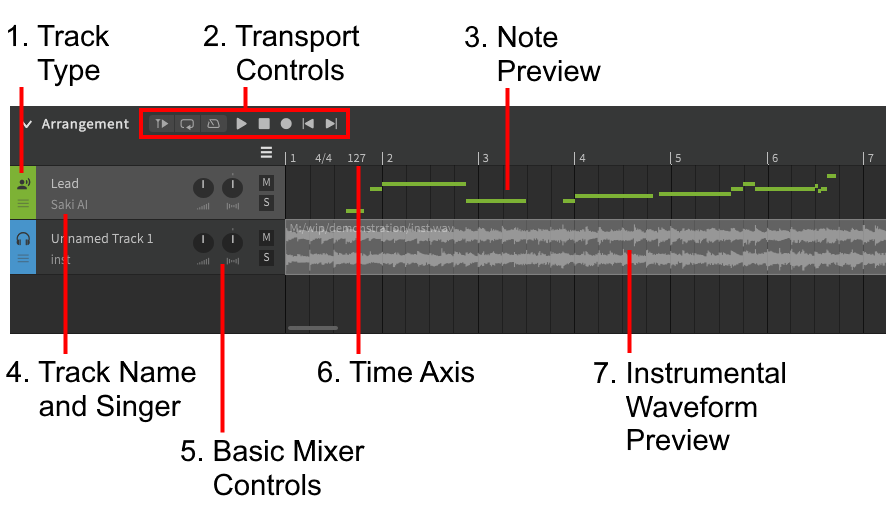

# 编曲栏

### 1. 轨道类型
标明轨道是人声轨道还是伴奏轨道，并用作使用鼠标进行拖放重新排序的句柄。

### 2. 播放控件
当焦点在编曲轨道时，将显示[播放控件](../quickstart/playback.md) will be displayed.

### 3. 音符预览
轨道中音符和音符组的概览

### 4. 曲名和歌手
轨道名称和当前选择的歌手。对于伴奏轨道，此处显示的是伴奏文件名而不是歌手。

### 5. 基本混音器控制
控制每个轨道的音量、平移、静音和独奏。

### 6. 时间轴
此处显示小节数，拍号和速度（BPM）。

### 7. 伴奏音频波形
伴奏的音频波形预览，可用于对齐轨道。

---

[报告问题](https://github.com/claire-west/svstudio-manual-zh/issues/new?template=report-a-problem.md&title=[Page: Arrangement])