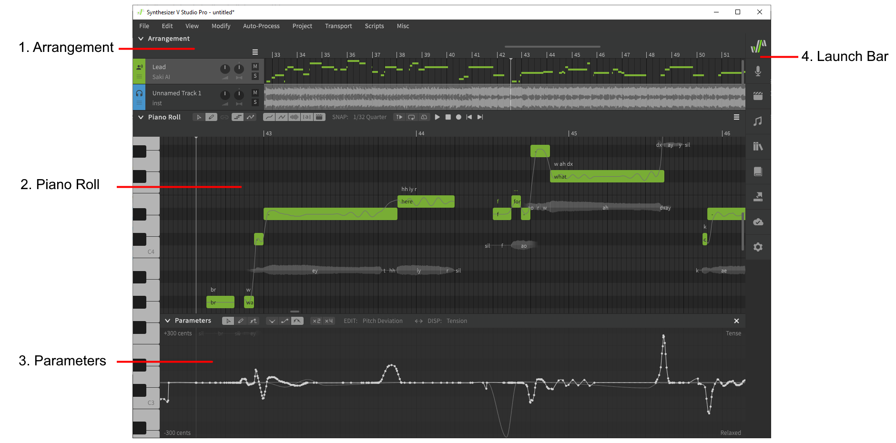
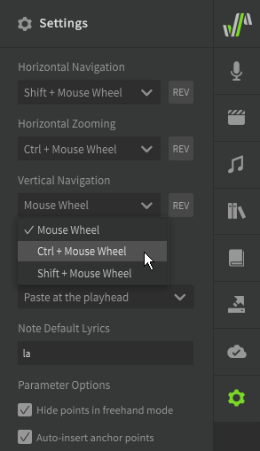
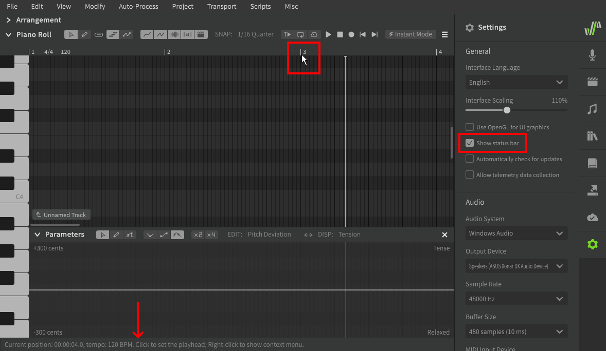

# 工作区

下图是一般项目的工作区

### 1. 编曲栏

此处显示人声和伴奏轨道，包括基本的混音器控制、时间轴信息和轨道内容预览。当焦点在此窗口时还会显示播放控件

### 2. 钢琴卷帘

此处是创建、编辑音符的主面板，当焦点在此窗口时还会显示播放控件。

### 3. 参数面板

用于查看和修改[参数曲线](../../parameters/parameters-panel)来影响歌声表现。

### 4. 启动栏

用于打开各种[侧面板](side-panels.md)。

## 调整工作区

除了使用底部和右侧边框上的滚动条外，您还可以使用++"modifier key"+mouse-wheel++组合。

|快捷键|描述|
|---|---|
|++mouse-wheel++|垂直滚动|
|++shift+mouse-wheel++|水平滚动|
|++ctrl+mouse-wheel++|水平缩放（以鼠标为中心）|

不支持垂直缩放

可以在“设置”面板中自定义用于每个功能的快捷键。

## 状态栏

如果在“设置”面板中启用了“显示状态栏”选项，则状态栏将在应用程序窗口底部可见。

状态栏根据当前鼠标光标位置显示上下文信息。

## 重新排列工作区

可以通过单击并拖动相应的标签来重新排列工作区面板。

## 视频演示

<iframe width="560" height="315" src="https://www.youtube-nocookie.com/embed/5f50-Ircdvs" title="YouTube video player" frameborder="0" allowfullscreen></iframe>

---

[报告问题](https://github.com/claire-west/svstudio-manual-zh/issues/new?template=report-a-problem.md&title=[Page: Workspace])