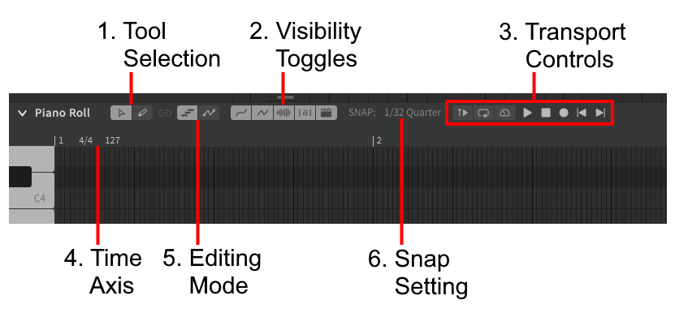
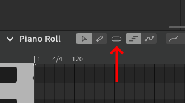
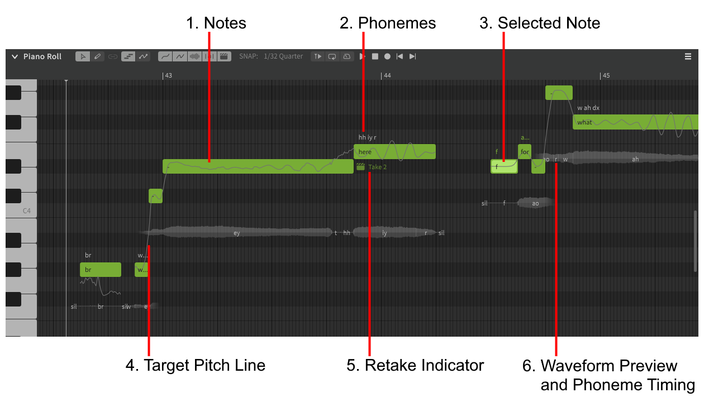
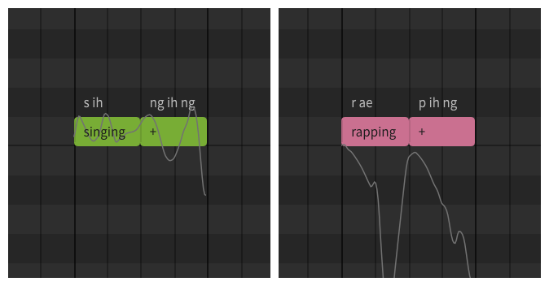
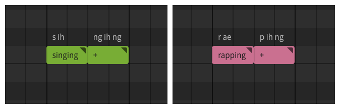

# 钢琴卷帘

## 钢琴卷帘工具栏

### 1. 工具切换
用于切换选择工具和编辑工具。选择工具（(++alt+1++)用于选择和修改音符，编辑工具(++alt+2++)用于创建音符和修改音高。

### 2. 可见性切换
切换钢琴卷帘各种元素的可见性：

- 目标音高
- 实际音高（仅限非AI歌手）
- 波形预览
- 音素
- 重录标志

### 3. 播放控件
当焦点在钢琴卷帘时，此处将显示[播放控件](../quickstart/playback.md)。

### 4. 时间轴
此处显示小节数，拍号和速度（BPM）。

### 5. 编辑模式
在音符编辑和音高编辑模式之间切换。

### 6. 自动对齐间隔
设置自动对齐网格间隔。

### 工具/模式链接
当任一选项发生更改时，可以点击链接(:material-link:)图标以切换所选工具和当前编辑模式。

## 钢琴卷帘主窗口

### 1. 注意事项
音符在钢琴卷中显示为彩色矩形，其垂直位置（音高）对应于左侧的钢琴键，其水平位置（时间）对应于上面的时间轴。

绿色音符代表[歌唱](../ai-functions/pitch-mode-sing.md)而红色音符代表[说唱](../ai-functions/pitch-mode-rap.md)如下所示的绿色或红色音符将根据所选的音高模式（“歌唱”或“说唱”）自动生成其音高曲线。

如果音符的右上角存在一个小三角形，则表示它已设置为[手动模式](../advanced/pitch-mode-manual.md), 允许用户完全控制音符的音高曲线。

当音符设置为手动模式时，其颜色表示在用户进行手动控制之前为其分配的模式，但是音高曲线将不再自动生成。设置为手动模式的音符的颜色对输出没有影响，仅用于直观地描绘项目中的歌曲和说唱部分。

### 2. 音素
音素代表歌手产生的实际声音。在音符中输入的每句歌词将自动转换为音素。

### 3. 被选中的音符
被选中的音符将高亮显示

### 4. 目标音高曲线
合成引擎在渲染音频输出时将尝试匹配的音高。

#### 4a. 实际音高曲线
使用非AI歌手时，蓝线将紧随目标音高线。这表示合成人声的实际渲染音高。

### 5. 重录标志
!!! note "Pro版功能 - AI重录"

    如果使用AI重录，则显示正在使用的重录名称。

### 6. 波形预览和音素
音符波形预览和音素发音位置。

---

[报告问题](https://github.com/claire-west/svstudio-manual-zh/issues/new?template=report-a-problem.md&title=[Page: Piano Roll])