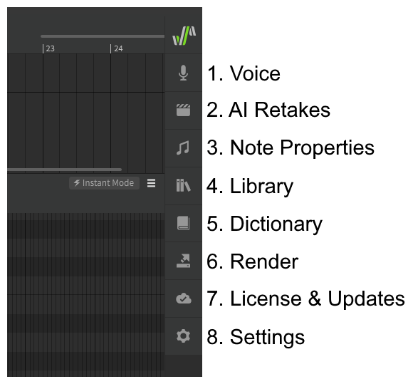

# 侧面板

可以从应用程序窗口一侧的菜单访问许多不同的面板。通过单击并拖动顶部的徽标，可以将此面板移动到布局的左侧或右侧。

侧面板也可以从应用程序顶部的“视图”菜单中打开。

## 启动栏

### 1. 语音
适用于整个曲目或组的常规设置，例如要使用的歌手、演唱的语言以及默认音符设置。

### 2. AI重录

!!! note "Pro版功能 - AI重录"

    用于创建和选择新的重录，包括音高和音色。

### 3. 音符属性
用于自定义所选音符的设置，例如修改音高过渡、颤音或音素计时。

### 4. 音符组
用于音符组的管理

### 5. 词典
管理字典条目，确定如何将歌词转换为音素。

### 6. 渲染
将音频导出为.wav文件

### 7. 许可证和更新
管理许可证和软件更新。

### 8. 设置
应用程序设置和键盘快捷键。

## 分离侧面板

侧面板可以通过拖动其标题来分离。

## 折叠面板选项

侧面板中的每个部分都可以通过单击其标题来折叠或展开。

## 侧面板详情

有关每个侧面板中选项的详细信息，请参阅[侧面板详情](../advanced/side-panels.md).

---

[报告问题](https://github.com/claire-west/svstudio-manual-zh/issues/new?template=report-a-problem.md&title=[Page: Side Panels])